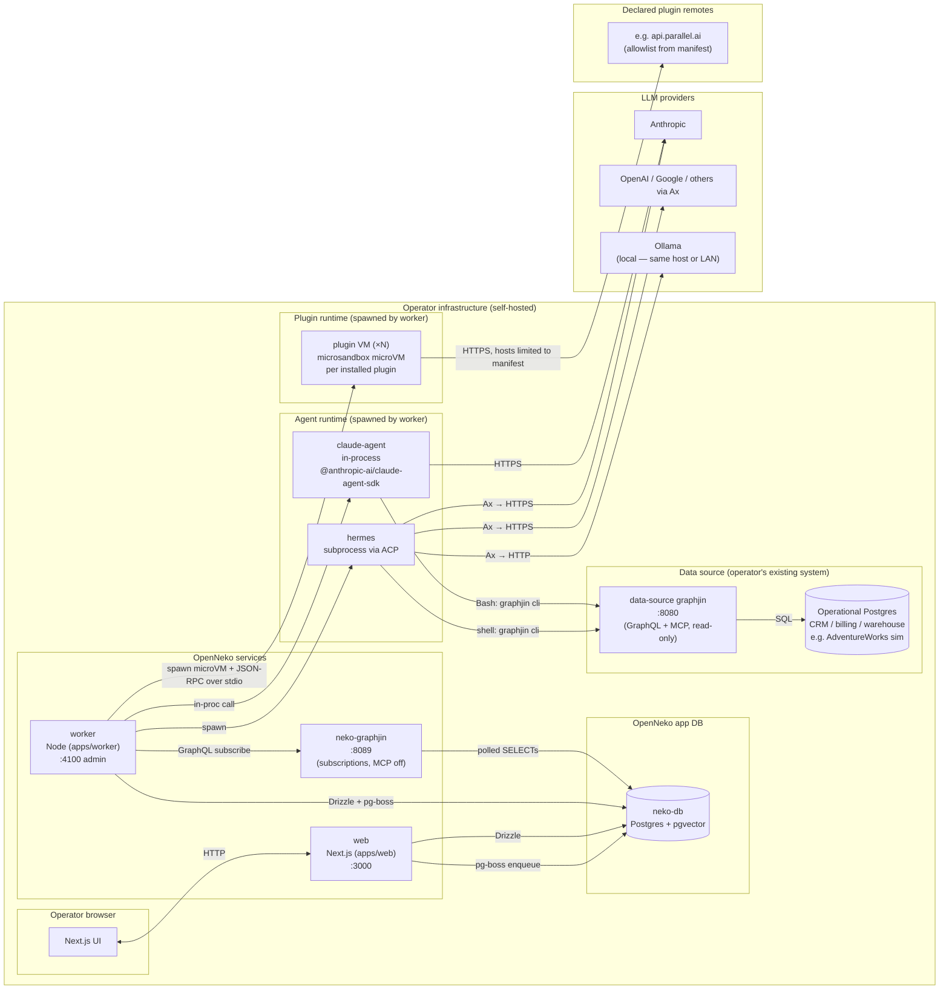
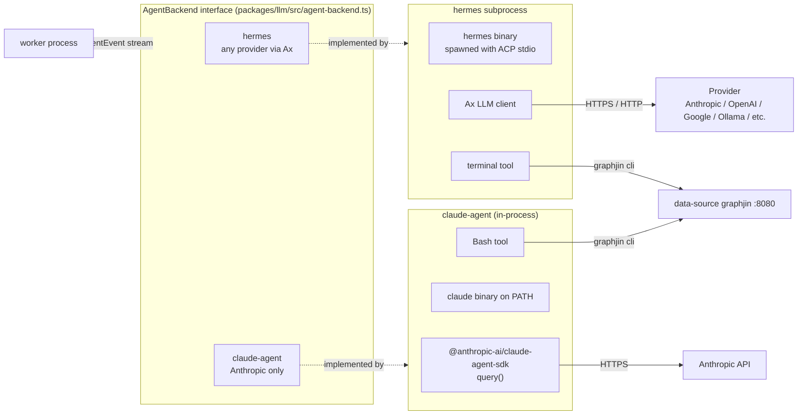
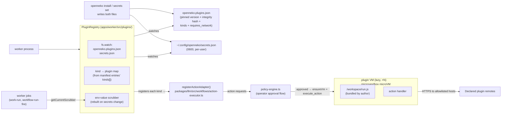
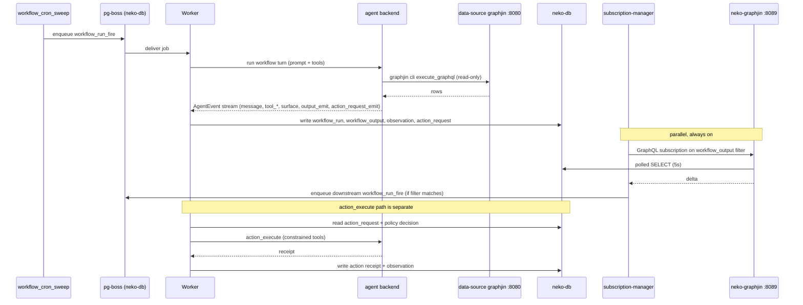

# OpenNeko Architecture

A map of the moving parts — services, databases, the agent runtime, and how they connect.

## Component map

OpenNeko is self-hosted. Everything below except the LLM providers runs inside the operator's own infrastructure.

The only traffic that ever leaves the operator's perimeter is the prompt/response call to a hosted LLM provider (Anthropic / OpenAI / Google / etc.) and any host declared in an installed plugin's manifest. **With Ollama as the provider and no plugins installed, nothing leaves at all** — model inference runs on the operator's own host or LAN, and OpenNeko is end-to-end local. Plugin VMs are themselves operator infrastructure but are isolated from the worker process: each runs in a microsandbox microVM whose outbound network is constrained to the hosts the plugin's manifest declared at install time. All databases, queues, and agent processes are local in every configuration. Local dev runs the whole thing in Docker Compose: `compose.yml` brings up `neko-db`, `neko-graphjin`, `web`, `worker`; `compose.adventureworks.yml` adds the data-source graphjin + a simulated AdventureWorks operational DB.

## The two-database boundary

Both databases are operator-owned and on operator hardware; the boundary isn't a trust boundary, it's a *responsibility* boundary. OpenNeko owns the schema of one and treats the other as an opaque read-only system of record.

| | OpenNeko app DB (`neko-db`) | Data-source DB |
|---|---|---|
| Schema authored by | OpenNeko — `db/migrations/*.sql` | The operator (their CRM / billing / warehouse) |
| Schema modeled in code | Yes — `packages/db/src/schema.ts` (Drizzle) | No — discovered at runtime by GraphJin |
| Worker write path | Drizzle (typed) + `pg-boss` | None — worker never connects |
| Worker read path | Drizzle, plus `neko-graphjin` :8089 for subscriptions | Indirect, only via the agent |
| Agent access | Forbidden | `graphjin cli execute_graphql` only, read-only, no raw SQL/HTTP, no mutations, no subscriptions, blocklist applied |
| Web (Next.js) | Drizzle | None |

Two GraphJin instances exist *because they do different jobs*:

- **`neko-graphjin` :8089** — over the app DB. Subscriptions only (`subs_poll_duration: 5s`). MCP off. This is the worker's event bus: the only reason to use GraphQL against a DB we already query with Drizzle is to get *push-style deltas* on `workflow_output` without hand-rolling `LISTEN/NOTIFY` and diffs.
- **Data-source graphjin :8080** — over the operator's operational DB. Full read GraphQL + MCP, exposed to the LLM agent. Mutations and subscriptions denied at the tool gate; `password`/`token`/`secret`/`encrypted` columns blocklisted. The lockdown is there because the LLM is talking to a production system whose schema we don't model — not because the DB is "external".

## Agent runtime

The worker is the only process that spawns agents. It picks a backend per org from `agent_backend_config`:

Both backends expose the same `AgentEvent` stream (`message`, `tool_start/end`, `surface`, `artifact`, `output_emit`, `action_request_emit`, `done`). Shared code MUST consume that interface; never branch on `backend.id === "claude-agent"`. New backends drop in via capability declarations, not switch statements.

**Why two backends.** Hermes is a subprocess that works with any provider via Ax — operator choice of model, including local Ollama for a fully air-gapped setup. Claude Agent runs in-process via the SDK + a `claude` binary on PATH — locked to Anthropic but fewer moving parts and better tool fidelity. The shell tool is named accordingly (`terminal` for hermes, `Bash` for claude-agent).

**Tool gate around the data source.** The prompt and the tool gate together enforce: all data-source access is through `graphjin cli execute_graphql`; no `execute_code`, no Python, no raw HTTP. Discovery (`list_tables`, `describe_table`, etc.) is pre-served via knowledge pack files written to the agent workspace at boot.

## Plugin runtime

Plugins extend the action surface (and, in a future revision, the MCP tool surface). They are installed by the operator with `openneko install <name>` and listed in `openneko.plugins.json` at the repo root. Discovery is federated: the OpenNeko-shipped [official marketplace](https://open-neko.github.io/plugins/) lists only the first-party `@open-neko/plugin-*` packages the OpenNeko team writes and supports. Anyone else can publish their own `marketplace.json` at a stable URL; operators trust it explicitly with `openneko marketplace add <url>`. OpenNeko makes no representation about non-official marketplaces — that trust is between the operator and the publisher.

**Every plugin runs inside a microsandbox microVM** — no exceptions, no "in-process for trusted" gradient, regardless of which marketplace it came from. The rationale: AI harnesses compose tool calls unpredictably, operators are not expected to audit plugin source, and OSS has no support contract — so the platform owns blast-radius containment for every plugin. The sandbox + the manifest's declared `requires_network` are what make federated curation defensible (compare Claude Code's marketplaces or OpenClaw's ClawHub, which run plugins unsandboxed and lean entirely on user-side trust).

On hosts where microsandbox cannot run, the plugin subsystem is disabled with a clear log line; the built-in `send_webhook` adapter remains as the unsandboxed extensibility path.

**Lifecycle (hot-reload, not boot-once).** The worker constructs a `PluginRegistry` at startup that watches `openneko.plugins.json` and the per-user secrets file via `fs.watch`. When the operator runs `openneko install <name>`, the CLI writes the manifest entry; the registry's watcher fires (debounced ~200 ms), it re-reads the files, registers adapters for the new plugin's declared kinds. **No worker restart.** When the operator runs `openneko secrets set …`, the watcher rebuilds the env-value scrubber too. When `openneko remove` deletes an entry, the registry stops the corresponding microVM. Park/resume is supported by `MicrosandboxRuntime` for cold-start mitigation but not used yet.

**Lazy VM spawn.** Plugin microVMs are NOT started at boot. The registry maps `kind → plugin` from the manifest's `kinds: string[]` field (written at install time from the marketplace entry — no VM spawn needed to know what each plugin handles). The first `execute_action` for a kind triggers `ensureVm()` which copies the bundled runner into a per-plugin host workspace, starts the microVM, calls `register()` once for a sanity check that the runtime's declared kinds match the manifest. Subsequent calls reuse the warm VM.

**RPC contract.** Worker invokes `node /workspace/run.js <method> <json-params>` inside the VM via `microsandbox.exec()`. One process per call — the runner reads the request, dispatches, prints a single `RpcResponse` JSON object on stdout, exits. Methods: `register` (called once on first VM spawn — plugin reports its declared action kinds for sanity), `execute_action` (per approved action request). RPC schema lives in `@open-neko/plugin-types`.

**Network policy from manifest.** Each plugin manifest entry declares `capabilities.network: [...]`. The registry translates this into a microsandbox network mode (empty list → `NetworkPolicy.none()`; non-empty → `NetworkPolicy.publicOnly()`) and applies it at VM creation. Per-host allowlist enforcement at the VM boundary is a v2 follow-up that depends on richer microsandbox `NetworkPolicy` modes; today the manifest declaration is the operator-visible contract surfaced on the marketplace Pages site.

**Env injection (secrets).** Marketplace entries declare `requires_env: [{ key, required, secret, description }]` for any env values the plugin needs at runtime (Slack bot tokens, API keys, etc.). The `openneko install` CLI prompts the operator for required keys during install and stores them in a per-user file at `$XDG_CONFIG_HOME/openneko/secrets.json` (default `~/.config/openneko/secrets.json`), 0600 perms. The registry reads that file at boot AND re-reads on every secrets-file change (operator can rotate a token via `openneko secrets set` without restarting). On each `execute_action` call the registry merges manifest `env` with the per-plugin secrets map (secrets winning) and passes the result to the runtime. The runtime injects values into the VM via a `sh -c 'export K=v ...; exec node /workspace/run.js ...'` wrapper (microsandbox 0.4.x has no builder-level env method); keys are validated to UPPER_SNAKE_CASE before reaching the shell so a malformed manifest can't smuggle a command-injection substring, and values are POSIX single-quoted. Secrets are never written to `openneko.plugins.json` (which is tracked) or `action_request.payload` (DB + logged).

**Env scrubber for agent output.** The registry also owns a value-scrubber rebuilt from every distinct secret value in the store on every refresh. Worker jobs (`work-run.ts`, `workflow-run-fire.ts`) snapshot the scrubber at job start and wrap every `AgentEvent` they persist — the agent's `Bash` tool calling `env | grep TOKEN`, a plugin's `stderr` echoing a token on auth failure, or an agent paraphrasing the value into a message would all be replaced with `[REDACTED]` before landing in `work_memory`, run replays, or the Briefing. Defense-in-depth on top of the sandbox + capability declarations; the scrubber catches verbatim leaks (the 95% case) but not transformations (`base64(token)`).

**Adapter integration.** When the registry registers an action kind, it builds an `ActionAdapter` that proxies `execute_action` calls through the VM RPC, and hands it to the existing `registerActionAdapter()` from `packages/llm/src/workflows/action-executor.ts`. Approved action requests continue to flow through `packages/llm/src/workflows/policy-engine.ts` exactly as built-in adapters do — the policy engine never knows or cares whether the adapter lives in-process or behind a VM.

**Shared install library.** The install orchestration (`runInstall`), secrets store, marketplace client, and manifest helpers live in `packages/plugin-install/` (`@open-neko/plugin-install`). Both the worker (via the registry) and the CLI consume it — one source of truth for the secrets-store shape, so the file the CLI writes is exactly the file the worker reads.

**Plugin-as-SSO-provider.** A plugin can opt in to OpenNeko's SSO contract by declaring `provides_auth: true` in its marketplace entry. When such a plugin is installed, the web app's `/signin` page renders a "Sign in with <provider>" button; clicking it kicks off an OIDC code-exchange that the plugin implements (`begin_auth` returns the IdP authorization URL, `complete_auth` exchanges the callback code for an `AuthIdentity`). The core upserts `app_user` from the identity and sets a signed session cookie — it never sees the IdP client secret, which lives in the plugin's VM env. The first-party `@open-neko/plugin-scalekit` fronts the entire enterprise IdP stack (Okta, Entra ID, Google Workspace, …) behind one integration. At most one auth plugin may be installed at a time; the registry surfaces a second claimant as `skipped`. The web app discovers whether an auth plugin is installed via `GET /admin/auth/status` on the worker; that endpoint reads the manifest entry's flag (no VM spawn needed) and is hot-reload-aware for the same reason actions are.

## Operating loop (OUDA)

Cron starts a chain; subscriptions propagate every link after. Outputs are non-mutating; action requests are the only thing that touches the world.

Worker job handlers in `apps/worker/src/jobs/`: `workflow-run-fire`, `action-execute`, `workflow-cron-sweep`, `workflow-output-ttl-sweep`, `business-profile-build`, `industry-insights-build`, `bootstrap-metrics-build`, `metric-refresh`, `work-run`.

## Memory and embeddings

Memory writes/reads are agent-driven (the agent calls explicit `memory_save` / `memory_search` tools). The embedding model is **in-process** — no external API.

- Model: `Xenova/all-MiniLM-L6-v2` (quantized, 384-dim) via `@huggingface/transformers` (`packages/llm/src/embedding.ts`).
- Storage: `work_memory.embedding` as `vector(384)` in `neko-db` (the pgvector image is used precisely for this).
- Retrieval: raw SQL with the `<=>` operator; Drizzle just declares the column type.
- Cache: model files baked into the image under `/app/.transformers-cache`; first cold load falls back to HF Hub.

## Process layout

| Process | Source | Talks to | Notes |
|---|---|---|---|
| `web` | `apps/web` (Next.js) | `neko-db` (Drizzle, pg-boss enqueue), `worker:4100` (admin) | Operator UI + API routes. Never reads the data-source DB. |
| `worker` | `apps/worker` (Node) | `neko-db` (Drizzle + pg-boss consumer), `neko-graphjin:8089` (subscriptions), agent backends (spawn/in-proc) | Owns all writes triggered by the loop. Hosts subscription manager. |
| `neko-graphjin` | `dosco/graphjin` + `db/graphjin/neko.yml` | `neko-db` | Subscriptions only. Internal CORS. MCP disabled. |
| data-source graphjin | `dosco/graphjin` + `db/graphjin/dev.yml` | Operational DB | Agent's read surface. GraphQL + MCP. Read-only via tool gate. |
| `neko-db` | `pgvector/pgvector:pg16` | — | App state, jobs, memory vectors. |
| Agent (hermes \| claude-agent) | spawned by `worker` | LLM provider, data-source graphjin via `graphjin cli` | Never opens a DB connection directly. |
| plugin VM (per installed plugin) | spawned by `worker` via `MicrosandboxRuntime`, **lazy** | Hosts declared in the plugin manifest's `capabilities.network` (e.g. `slack.com`, `search.parallel.ai`) | One microsandbox microVM per plugin. Spawned on first `execute_action` for that plugin, kept warm. Talks to the worker via JSON-RPC over stdio. Never opens a DB connection. Disabled on unsupported hosts (Windows, Linux without KVM, macOS x86_64). |
| `openneko` CLI | `apps/openneko-cli` (Node), vendored from `@open-neko/cli` | `npm` (to install plugin packages), `openneko.plugins.json` + `~/.config/openneko/secrets.json` on the operator's host | Operator surface for plugin install/list/remove/secrets/marketplace. Published to npm as `@open-neko/cli`; available in-repo as `pnpm openneko …`. Inside the worker container, the binary is on PATH so the agent's Bash tool can drive it directly. |

## Where to look next

- DB schema (Drizzle): `packages/db/src/schema.ts`, migrations in `db/migrations/`
- Agent backends and event stream: `packages/llm/src/agent-backend.ts`, `packages/llm/src/agent-backends/`
- Subscription manager: `packages/llm/src/workflows/subscription-manager.ts`
- Worker jobs: `apps/worker/src/jobs/`
- Plugin runtime + registry: `apps/worker/src/plugins/microsandbox-runtime.ts` (microVM + RPC), `apps/worker/src/plugins/plugin-registry.ts` (fs.watch + lazy spawn + scrubber)
- Plugin install + secrets shared library: `packages/plugin-install/` (`@open-neko/plugin-install` — consumed by both worker and CLI)
- Plugin RPC schema: `@open-neko/plugin-types` ([source](https://github.com/open-neko/plugins/tree/main/packages/types))
- Env-value scrubber: `packages/llm/src/work/secret-scrubber.ts`
- Plugin source + official marketplace: [github.com/open-neko/plugins](https://github.com/open-neko/plugins) (Pages site at [open-neko.github.io/plugins](https://open-neko.github.io/plugins/))
- Operator CLI (vendored): `apps/openneko-cli/` (published as `@open-neko/cli`; the standalone `open-neko/cli` repo is archived)
- GraphJin configs: `db/graphjin/neko.yml` (app DB), `db/graphjin/dev.example.yml` (data source)
- Compose topology: `compose.yml`, `compose.adventureworks.yml`
