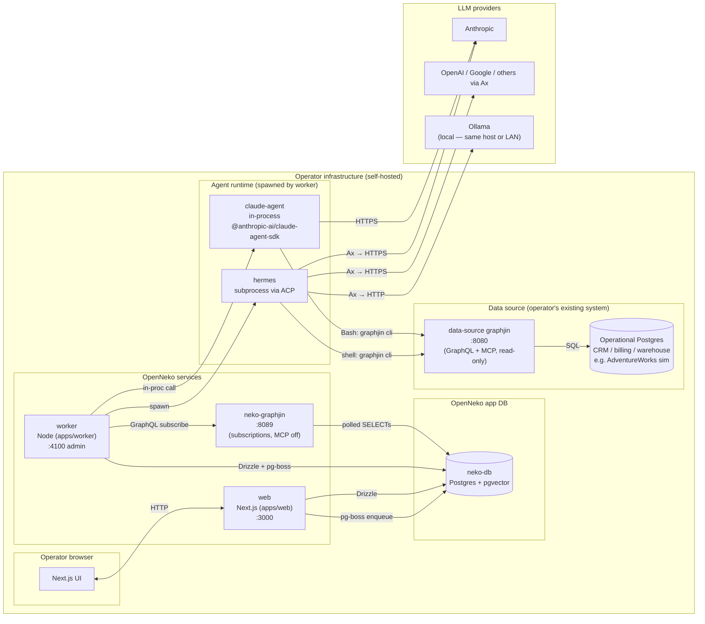
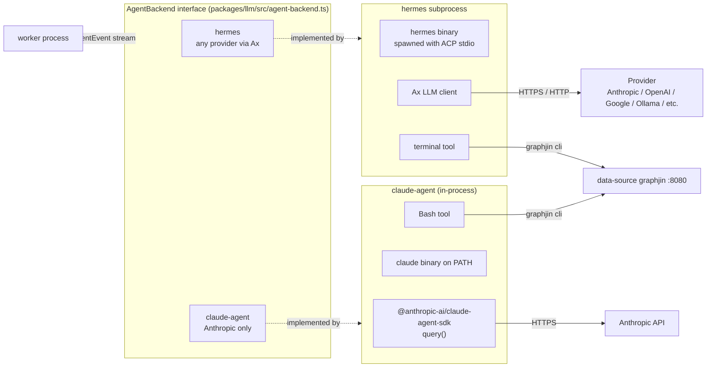
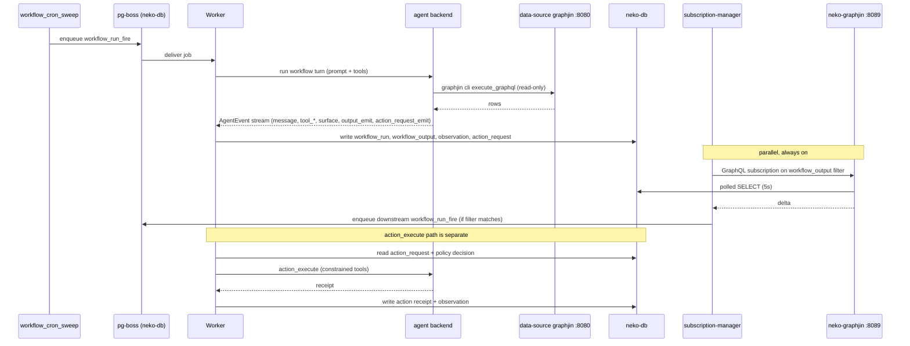

# OpenNeko Architecture

A map of the moving parts — services, databases, the agent runtime, and how they connect.

## Component map

OpenNeko is self-hosted. Everything below except the LLM providers runs inside the operator's own infrastructure.

The only traffic that ever leaves the operator's perimeter is the prompt/response call to a hosted LLM provider (Anthropic / OpenAI / Google / etc.). **With Ollama as the provider, nothing leaves at all** — model inference runs on the operator's own host or LAN, and OpenNeko is end-to-end local. All databases, queues, and agent processes are local in every configuration. Local dev runs the whole thing in Docker Compose: `compose.yml` brings up `neko-db`, `neko-graphjin`, `web`, `worker`; `compose.adventureworks.yml` adds the data-source graphjin + a simulated AdventureWorks operational DB.

## The two-database boundary

Both databases are operator-owned and on operator hardware; the boundary isn't a trust boundary, it's a *responsibility* boundary. OpenNeko owns the schema of one and treats the other as an opaque read-only system of record.

| | OpenNeko app DB (`neko-db`) | Data-source DB |
|---|---|---|
| Schema authored by | OpenNeko — `db/migrations/*.sql` | The operator (their CRM / billing / warehouse) |
| Schema modeled in code | Yes — `packages/db/src/schema.ts` (Drizzle) | No — discovered at runtime by GraphJin |
| Worker write path | Drizzle (typed) + `pg-boss` | None — worker never connects |
| Worker read path | Drizzle, plus `neko-graphjin` :8089 for subscriptions | Indirect, only via the agent |
| Agent access | Forbidden | `graphjin cli execute_graphql` only, read-only, no raw SQL/HTTP, no mutations, no subscriptions, blocklist applied |
| Web (Next.js) | Drizzle | None |

Two GraphJin instances exist *because they do different jobs*:

- **`neko-graphjin` :8089** — over the app DB. Subscriptions only (`subs_poll_duration: 5s`). MCP off. This is the worker's event bus: the only reason to use GraphQL against a DB we already query with Drizzle is to get *push-style deltas* on `workflow_output` without hand-rolling `LISTEN/NOTIFY` and diffs.
- **Data-source graphjin :8080** — over the operator's operational DB. Full read GraphQL + MCP, exposed to the LLM agent. Mutations and subscriptions denied at the tool gate; `password`/`token`/`secret`/`encrypted` columns blocklisted. The lockdown is there because the LLM is talking to a production system whose schema we don't model — not because the DB is "external".

## Agent runtime

The worker is the only process that spawns agents. It picks a backend per org from `agent_backend_config`:

Both backends expose the same `AgentEvent` stream (`message`, `tool_start/end`, `surface`, `artifact`, `output_emit`, `action_request_emit`, `done`). Shared code MUST consume that interface; never branch on `backend.id === "claude-agent"` (see `feedback_backend_portability.md`).

**Why two backends.** Hermes is a subprocess that works with any provider via Ax — operator choice of model, including local Ollama for a fully air-gapped setup. Claude Agent runs in-process via the SDK + a `claude` binary on PATH — locked to Anthropic but fewer moving parts and better tool fidelity. The shell tool is named accordingly (`terminal` for hermes, `Bash` for claude-agent).

**Tool gate around the data source.** The prompt and the tool gate together enforce: all data-source access is through `graphjin cli execute_graphql`; no `execute_code`, no Python, no raw HTTP. Discovery (`list_tables`, `describe_table`, etc.) is pre-served via knowledge pack files written to the agent workspace at boot.

## Operating loop (OUDA)

Cron starts a chain; subscriptions propagate every link after. Outputs are non-mutating; action requests are the only thing that touches the world.

Worker job handlers in `apps/worker/src/jobs/`: `workflow-run-fire`, `action-execute`, `workflow-cron-sweep`, `workflow-output-ttl-sweep`, `business-profile-build`, `industry-insights-build`, `bootstrap-metrics-build`, `metric-refresh`, `work-run`.

## Memory and embeddings

Memory writes/reads are agent-driven (the agent calls explicit `memory_save` / `memory_search` tools). The embedding model is **in-process** — no external API.

- Model: `Xenova/all-MiniLM-L6-v2` (quantized, 384-dim) via `@huggingface/transformers` (`packages/llm/src/embedding.ts`).
- Storage: `work_memory.embedding` as `vector(384)` in `neko-db` (the pgvector image is used precisely for this).
- Retrieval: raw SQL with the `<=>` operator; Drizzle just declares the column type.
- Cache: model files baked into the image under `/app/.transformers-cache`; first cold load falls back to HF Hub.

## Process layout

| Process | Source | Talks to | Notes |
|---|---|---|---|
| `web` | `apps/web` (Next.js) | `neko-db` (Drizzle, pg-boss enqueue), `worker:4100` (admin) | Operator UI + API routes. Never reads the data-source DB. |
| `worker` | `apps/worker` (Node) | `neko-db` (Drizzle + pg-boss consumer), `neko-graphjin:8089` (subscriptions), agent backends (spawn/in-proc) | Owns all writes triggered by the loop. Hosts subscription manager. |
| `neko-graphjin` | `dosco/graphjin` + `db/graphjin/neko.yml` | `neko-db` | Subscriptions only. Internal CORS. MCP disabled. |
| data-source graphjin | `dosco/graphjin` + `db/graphjin/dev.yml` | Operational DB | Agent's read surface. GraphQL + MCP. Read-only via tool gate. |
| `neko-db` | `pgvector/pgvector:pg16` | — | App state, jobs, memory vectors. |
| Agent (hermes \| claude-agent) | spawned by `worker` | LLM provider, data-source graphjin via `graphjin cli` | Never opens a DB connection directly. |

## Where to look next

- DB schema (Drizzle): `packages/db/src/schema.ts`, migrations in `db/migrations/`
- Agent backends and event stream: `packages/llm/src/agent-backend.ts`, `packages/llm/src/agent-backends/`
- Subscription manager: `packages/llm/src/workflows/subscription-manager.ts`
- Worker jobs: `apps/worker/src/jobs/`
- GraphJin configs: `db/graphjin/neko.yml` (app DB), `db/graphjin/dev.example.yml` (data source)
- Compose topology: `compose.yml`, `compose.adventureworks.yml`
