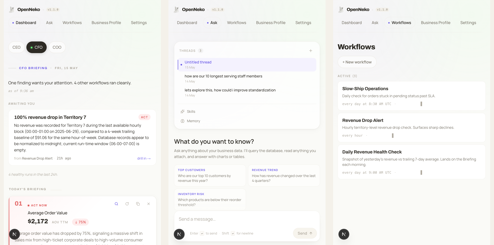

# OpenNeko

An always-on operating loop for CXO data — observe, understand, decide, act.



OpenNeko connects to your operational data, runs role-aware workflows that watch the business, and proposes actions for you to approve. Findings, approvals, and follow-up analysis all live in a single focused workspace.

## Features

- **Briefing** — your morning landing surface: what's awaiting you, what you've pinned, what's worth a look, what was quiet.
- **Workflows** — author cron- or signal-triggered workflows in chat; each run lands on a dedicated page with phase timing, outputs, and proposed actions.
- **Subscriptions + observations** — workflows can subscribe to each other's outputs (lineage-tracked, with cycle detection) so the operating loop chains automatically.
- **Action stack** — policy-gated mutations with two-tier approval; nothing external fires without your decision.
- **Approvals** — single queue for pending actions; inline approve / reject with reason.
- **Policies** — authored and edited through Ask; destructive operations get explicit UI controls.
- **Ask** — chat-first follow-up analysis against your business data, with tool-call clusters that fold into the transcript.
- Configurable agent backend (Hermes or Claude Agent) and model provider.
- Optional industry research provider.
- Bundled AdventureWorks sample-data stack for first-run trials.

## Try it in 10 minutes

You'll need Docker and one LLM provider API key. Spin up OpenNeko with the included AdventureWorks sample-data services:

```bash
git clone https://github.com/open-neko/neko.git
cd neko
docker compose -f compose.yml -f compose.adventureworks.yml up -d --build
docker compose -f compose.yml -f compose.adventureworks.yml run --rm neko-adventureworks-seed
```

Open [http://localhost:3000](http://localhost:3000) and finish the setup wizard.

For full install steps, requirements, updates, troubleshooting, and connecting your own data, see [INSTALL.md](INSTALL.md).

### Watch the loop fire end-to-end

The seed pre-loads three workflows on the AdventureWorks data so the trial isn't a blank page:

- **Daily Revenue Health Check** (9am cron) — yesterday's revenue vs the trailing 7-day average; lands on the Briefing tagged good / watch / act.
- **Revenue Drop Alert** (hourly cron) — per-territory current-hour revenue vs the same hour-of-week baseline averaged over the prior 4 weeks; if any territory falls below 50%, proposes a Slack alert to `#revenue-alerts` for your approval.
- **Slow-Ship Operations** (8:30am cron) — orders stuck in *pending* for more than 5 days, with the oldest 3 order IDs.

To see the loop without waiting for an organic dip, fire the Germany revenue-drop scenario. It tells the order trickle to stop generating new orders for territory 8 (Germany) for three hours:

```bash
docker compose -f compose.yml -f compose.adventureworks.yml \
  exec adventureworks-scenario-injector \
  /scripts/scenario-injector.sh fire germany-revenue-drop
```

Wait ~15 minutes for the trickle to skip a couple of Germany ticks, then click **+ Run now** on **Revenue Drop Alert** in `/workflows`. Within seconds a finding lands on the Briefing — Germany's hourly revenue well below its baseline — and a proposed Slack alert sits in the Action stack for your approve / reject. Click approve; nothing leaves the box (the trial defaults `NEKO_ACTIONS_DRY_RUN=true`, so even approved external actions go to a mock adapter until you wire real webhooks).

That's the loop: workflow watches → finding lands → action proposed → you approve. Once it clicks, write your own watcher in chat from `/work`, and when you're ready, swap AdventureWorks for your real data source — see [INSTALL.md](INSTALL.md) for connecting GraphJin to your CRM, billing, or warehouse.

## Issues

Please file bugs and feature requests at [github.com/open-neko/neko/issues](https://github.com/open-neko/neko/issues).

## Contributing

Pull requests are welcome. See [CONTRIBUTING.md](CONTRIBUTING.md) for the developer setup, repository layout, and the checks to run before opening a PR.

## License

OpenNeko is licensed under the [Apache License 2.0](LICENSE).

## Author

Created by [Amit Deshmukh](https://github.com/amitdeshmukh).
