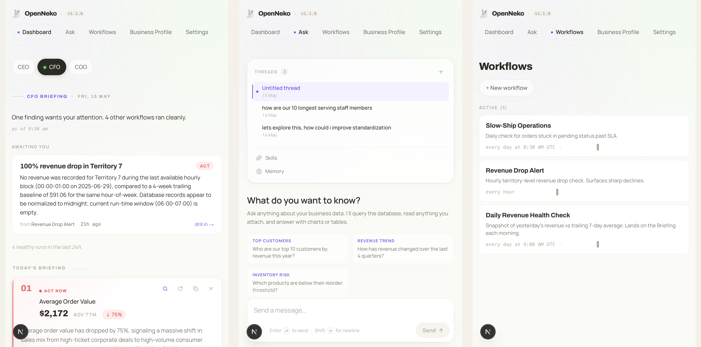

# OpenNeko

[](LICENSE)
[](https://github.com/open-neko/openneko/releases/latest)
[](INSTALL.md)
[](https://openneko.app)
[](https://github.com/open-neko/openneko/stargazers)

**OpenNeko watches your business data, flags what's worth a look, and drafts the next action — for you to approve.** Self-hosted, on your infrastructure, with whichever LLM you prefer.

> The intelligence is rented; the findings, rules, and decisions are yours. Models keep changing — the memory of how your business actually runs (promises, exceptions, baselines, decisions) shouldn't live inside the vendor that rents you the model. OpenNeko keeps the agent **and** that memory on your infrastructure.



## Quickstart

You'll need **Docker** and **one LLM provider API key**.

```bash
curl -fsSL https://openneko.app/install.sh | sh
mkdir -p ~/openneko && cd ~/openneko
openneko setup --mode demo
```

The installer detects your OS/arch (Homebrew on macOS, a checksum-verified release binary on Linux) and checks for Docker. `openneko setup` then runs preflight checks, brings up the stack, and walks you through configuration **right in the terminal** — admin password, data source, model provider + key. Prefer a browser? Choose **browser** at the first prompt (or pass `--skip-onboarding`) to finish the wizard at [http://localhost:3000](http://localhost:3000).

The demo seeds three watchers against sample data — kick off **Slow-Ship Operations** from `/workflows` and watch an *"orders stuck in pending > 5 days"* finding land on your Briefing.

Full propose-and-approve walkthrough, the live trial (order simulator + scenario injector), and connecting your own data → **[INSTALL.md](INSTALL.md)**.

Hosting several smaller customers on one VM? Named installations isolate each
customer's Compose project, databases, secrets, sandbox state, backups, ports,
and Docker network. See [Multiple customer instances](INSTALL.md#multiple-customer-instances-on-one-host).

## What you get

The full feature catalog, in plain language, lives in **[FEATURES.md](FEATURES.md)** — ask-anything answers, chat-first administration, watchers, channels (Slack / Telegram), personal-vs-team knowledge, and the verifiable security model. The highlights:

- **Operational findings on the Briefing.** A SKU below reorder, orders stuck in *pending* for days, payment retries piling up — checked on a schedule and posted as findings.
- **Watchers you describe in plain English.** *"Alert me when any SKU's on-hand stock drops below its reorder point."* OpenNeko schedules it, runs it, and writes up what it found.
- **Actions drafted, not auto-fired.** Slack alerts, Gmail follow-ups, Sheets updates, Shopify writes — proposed with the finding that triggered them, queued for your approval. Write a rule when you want a specific class of safe action to auto-fire.
- **Follow-up questions about your data, in chat.** *"Which territories drove this week's revenue drop?"* — drill in on a finding without leaving the app or writing SQL.
- **A complete record of what fired, when, and why.** Every proposal, decision, and execution stays against the finding that triggered it — auditable, searchable, yours.

## How your data gets in

OpenNeko reads through **[GraphJin](https://graphjin.com)**, a GraphQL gateway you point at data you already have:

- **Databases** — Postgres, MySQL, and [more](https://graphjin.com), with an auto-generated query surface.
- **Files, external APIs, custom code** — first-class GraphQL fields via GraphJin's script layer.

One consistent surface no matter where the data lives — you don't write per-connector plumbing.

## What stays yours

OpenNeko separates the *intelligence* (the model) from the *memory* (your business's context) on purpose. Swap the model whenever something better ships; the rest doesn't move.

The memory layer runs on your own Postgres, on your own infrastructure:

- **Findings & briefings** — every watcher run and result, kept against the watcher that produced it.
- **Pinned facts & learned rules** — what the agent figured out and you confirmed, kept separate from what the agent proposed and you haven't decided on yet.
- **Document library** — files you upload, distilled by a librarian agent into concepts the assistant searches and cites. Private to you until you share; team knowledge only after a human approves it.
- **Action policies** — your rules for what auto-fires, what queues, what's blocked.
- **Decision history** — every approval, rejection, and execution receipt.

Apache-2.0 core, self-hosted, single Postgres. Take a backup, take it with you — and the team library exports as a plain-Markdown [Open Knowledge Format](https://github.com/GoogleCloudPlatform/knowledge-catalog/tree/main/okf) bundle any OKF-aware tool can read.

## Plugins

Add new action kinds with sandboxed plugins — web search, Slack, Gmail, Shopify, Sheets, Telegram, and more. Enterprise SSO comes from the Scalekit plugin: install it, authorize the workspace from **Admin → Settings → Single sign-on** (a guided checklist), and every Scalekit-backed IdP (Okta, Entra ID, Google Workspace…) lights up — plus the agent gains 35 workspace-management tools.

- **Every plugin runs in an isolated OpenShell sandbox**, with outbound network limited to what its manifest declares.
- **Secrets are scoped per plugin** and never reach the model context.

Browse the [marketplace](https://open-neko.github.io/plugins/) · capability model, install policy, and host support in **[PLUGINS.md](PLUGINS.md)**.

```bash
openneko install @open-neko/plugin-scalekit
```

## Under the hood

- **Self-hosted via Docker.** One binary, one `start` command. Data lives on your Postgres.
- **Bring your own LLM.** Hermes runs against Anthropic, OpenAI, Google, Ollama, and other compatible providers. Change providers without changing the sandboxed agent runtime.
- **Plugins in OpenShell sandboxes.** Outbound network is allowlisted per manifest, not blanket-open.
- **Agent in a sandbox by default.** The agent loop itself runs inside an OpenShell policy sandbox — default-deny egress, and the model API key never enters the box (the gateway proxy injects it on the wire). See [OPENSHELL.md](OPENSHELL.md).
- **Apache-2.0.** Read the source, self-host, fork, and build on it. OpenNeko trademarks are separately controlled — see [LICENSING.md](LICENSING.md) and [TRADEMARKS.md](TRADEMARKS.md).

## Evaluations

OpenNeko evaluates an agent backend through the production Work runtime, not as
an isolated model call. The suite exercises skills, memories, library retrieval,
workflows, Records, governed actions, channel delivery, compaction, and GraphJin
tools against a frozen AdventureWorks snapshot.

| Backend | Model | OpenNeko source | Coverage | Full-task pass | Publication status | Evidence |
|---|---|---|---:|---:|---|---|
| Harness control | `scripted:deterministic-v1` | [`c666b70`](https://github.com/open-neko/openneko/commit/c666b70f53fb54e947463296c33f2bb0c8e50323) | 59 tasks × 1 (59 episodes) | 59/59 (100%) | Accepted; deterministic control, not a model result | [Full result](evals/results/openneko-backend-scripted-good-v3/run-20260905t051547480z-a6145dfb/summary.md) |
| Hermes | `google-gemini:gemini-3.6-flash` | [`de7ff04`](https://github.com/open-neko/openneko/commit/de7ff04272b18785186bed1003b698a4b5003004) | 59 tasks × 3 (177 episodes) | 53/59 (89.8%) | Rejected; capability gates failed, 11 execution failures, 0 unsafe effects | [Full result](evals/results/openneko-backend-hermes-v3/run-20260905t052736658z-f6ed98f5/summary.md) |

Provider-backed results are published separately from clean source commits so
that every reported OpenNeko version is reproducible. Publication validity and
backend qualification are separate: an integrity-valid run is complete,
reproducible evidence, while `accepted: true` requires every suite gate to pass.
Rejected runs remain visible as `accepted: false` and are not passing backends or
release qualifications. See the [evaluation methodology](evals/README.md), the [backend benchmark
contract](evals/BACKEND-BENCHMARK.md), and the [contribution
guide](evals/CONTRIBUTING.md).

## Stack modes

`openneko start|setup|upgrade --mode prod|dev|demo` picks which Compose layers the
CLI deploys. Every mode shares the same core: app + records Postgres, migrations,
backup/restore, web, worker, three internal GraphJin instances (app
subscriptions, records, records-watch), plus the customer-facing GraphJin in
sources (agentic) mode. The OpenShell sandbox runtime (gateway, registry,
certgen) is always layered on top — it is the only way agents and plugins run,
in every mode.

| Mode | Layers on top of core | What's different |
|------|----------------------|------------------|
| **prod** (default) | none | Core stack only. You connect your own data source; actions run for real. |
| **demo** | AdventureWorks sample DB, seed job, order simulator, scenario injector | Customer GraphJin points at the sample data. What `openneko setup --mode demo` gives you. |
| **dev** | none (reserved overlay) | For working on OpenNeko itself: Docker runs only the dependency services while web and worker hot-reload as host processes (`pnpm dev:setup && pnpm dev`, using the repo's root `compose.yml`) — see [CONTRIBUTING.md](CONTRIBUTING.md). |

**Solution packs** (e.g. `openneko pack install magento`) are not a mode: they
layer onto a running stack in any mode, adding sources, specs, and saved queries
to the customer GraphJin config at runtime.

## Docs

- [PACKS.md](PACKS.md) — authoring solution packs, directory layout, connectors, validation, and contributions
- [INSTALL.md](INSTALL.md) — install, [upgrade](INSTALL.md#upgrade), requirements, troubleshooting, connecting your data, full demo trial
- [PLUGINS.md](PLUGINS.md) — plugin capabilities, sandbox/security model, marketplaces, install policy, host support
- [OPENSHELL.md](OPENSHELL.md) — preview: running the agent itself in an OpenShell policy sandbox (architecture, security, how to enable)
- [SECRETS.md](SECRETS.md) — secrets at rest and the optional Infisical vault (enterprise)
- [CONTRIBUTING.md](CONTRIBUTING.md) — dev setup, repo layout, pre-PR checks
- [evals/README.md](evals/README.md) — community-configurable harness evals,
  AdventureWorks baselines, resumable runs, checked-in results, and production
  OpenTelemetry
- [CHANGELOG.md](CHANGELOG.md) — releases

## Issues

Please file bugs and feature requests at [github.com/open-neko/openneko/issues](https://github.com/open-neko/openneko/issues).

## Contributing

Pull requests are welcome — on your first PR a bot will ask you to sign a quick [Contributor License Agreement](CLA.md). See [CONTRIBUTING.md](CONTRIBUTING.md) for the developer setup, repository layout, and the checks to run before opening a PR.

## License

OpenNeko source code is licensed under the [Apache License 2.0](LICENSE). Third-party and modular components remain under their own licenses. The OpenNeko name and logo are governed by [TRADEMARKS.md](TRADEMARKS.md). See **[LICENSING.md](LICENSING.md)** for the full model.

## Author

Created by [Amit Deshmukh](https://openneko.app/#about).
