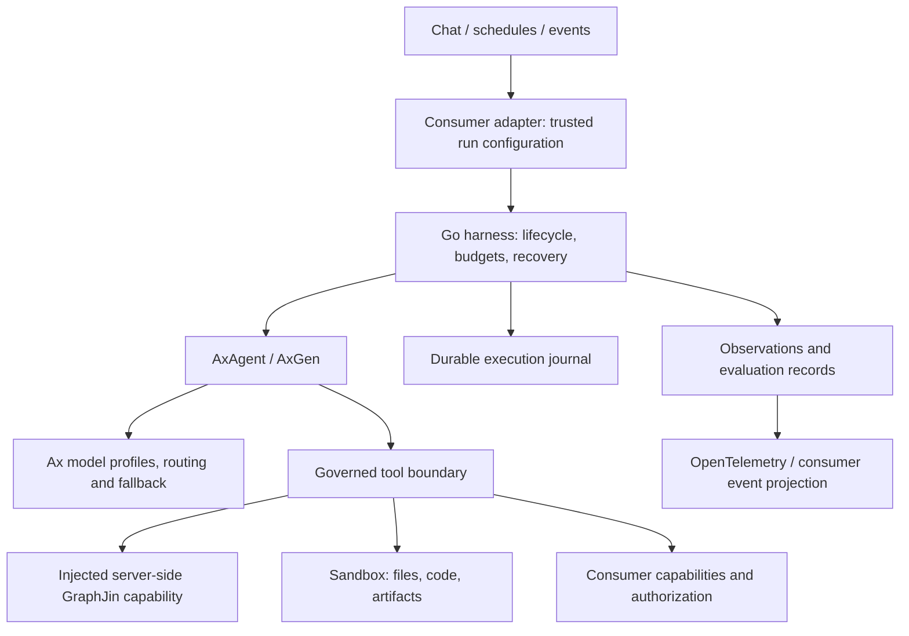

# Go Harness

Status: working design; M1 compatibility implementation started. Updated: 2026-09-19.

**Integration boundary:** build and package the harness independently. OpenNeko is the first consumer. Prefer its existing launch, policy, event and result contracts; keep compatibility in the adapter. A small, justified product integration change may be preferable to a permanent workaround and should be reviewed explicitly. Seamless worker/web operation is an acceptance gate, not yet a verified property.

This document records the current design direction, source findings, implementation notes, and questions to resolve. Proposed behavior is not a claim that Ax or OpenNeko already implements it. Initial HTTP/Goja compatibility and cancellation checks now exist in [the Go module](../README.md); OpenShell/worker/web qualification and durable crash-recovery tests remain outstanding.

Detailed integration research: [OpenShell, broker and Ax compatibility](OPENSHELL.md). This covers the checked-in OpenShell version, credential replacement, transport requirements, multi-provider routing, broker recovery, sandbox lifecycle and required integration tests.

OpenShell upgrade target: qualify **v0.0.116** against the checked-in **0.0.54** baseline. Released endpoint binding, managed-refresh handles and Docker OTLP tracing better support this design. Retain the existing host launcher initially: the new Go SDK has useful control/streaming APIs, but its tagged default file-transfer transport is unimplemented. See the companion document for release evidence, static-versus-managed rotation limits and rollout gates. No runtime upgrade has been performed.

## 1. Scope and agreed direction

- Build an independent Go harness; OpenNeko is the first consumer.
- Use Ax extensively for model access, routing, structured generation, context handling, and agent execution where its Go contracts fit.
- Delegate GraphJin lookups to its server-side agent. Keep data discovery and query investigation there.
- Learn from Claude Code's execution invariants and Aithy's Ax integration.
- Make telemetry and evaluation part of every runtime capability from the beginning.
- Implementation was authorized after milestone planning; begin with the M1 compatibility gates.

The intended improvement is measurable reliability and task quality: recover safely, preserve intent, use evidence, expose progress, and spend model budget effectively. Feature count is not an acceptance criterion.

## 2. Architecture and ownership

Provisional choice: AxAgent owns the reasoning loop inside an application-neutral Go execution supervisor. The supervisor owns durable execution and governed access to tools. Do not create a second planner or independent retry loop around AxAgent.

| Owner | Responsibilities |
| --- | --- |
| Go harness | Run ownership, accepted inputs, operation records, authorization context, budgets, cancellation, durable checkpoints, recovery, neutral events |
| Ax | Provider normalization, model routing, typed generation, reasoning stages, runtime context management, supported model/tool telemetry |
| GraphJin agent | Catalog-first discovery, governed lookups, evidence and typed investigation results |
| Consumer control plane | Identity, credential brokering, action requests, approval decisions, workflow scheduling, existing product persistence |
| Sandbox boundary | Filesystem, process and network containment; resource limits and process termination |

Preserve a trusted host/sandbox split. The optional OpenNeko adapter uses its existing host and broker. Production credentials and authoritative policy do not become model context or general-purpose runtime globals.

Fallback design: a custom Go model/tool loop using Ax's lower-level model APIs, only if AxAgent cannot expose the execution boundaries needed for recovery and governance. Prefer a focused upstream Ax extension over maintaining two competing engines.

### Consumer boundary

Keep the first integration to a versioned run specification, ordered events, one
terminal result, cancellation and scoped tool capabilities. The run specification
carries trusted instructions, input identity, approved model routes and limits;
model output cannot grant authority. Events carry run/attempt/operation IDs and
sequence numbers so adapters can correlate and deduplicate delivery. Terminal
results distinguish completed, failed and cancelled work; unknown external effects
remain explicit. Finalize concrete types with the first executable runtime slice.

GraphJin is an injected capability, not a database dependency. Product tenant
resolution, broker URLs, wire markers, job formats and business approvals belong
under `adapters/openneko`. The core imports no consumer adapter. Keep packages
static; no plugin registry or general plugin-loading system is required.

The standalone Ax/OpenShell suite must pass without any OpenNeko checkout. Product
acceptance is a separate layer using the real worker, broker and web app.
Existing product contracts are constraints on the adapter, not the harness API.

## 3. AxAgent findings and implications

### Reasoning stages

AxAgent's documented pipeline is distiller → executor → responder. The distiller narrows the request and evidence; the executor runs actor code against runtime values and tools; the responder produces the declared output. A direct-response path can skip the executor for suitable requests.

Large inputs can remain in runtime state with compact shape summaries in prompts. This is useful for structured GraphJin results, documents and calculations. It does not establish a security boundary against malicious source content: tool authorization must remain enforced by the host.

Implementation notes:

- Preserve the original request, explicit constraints and authorization outside model-generated distillation.
- Treat distilled requests and recalled memories as derived context, not authority.
- Measure latency, usage, errors and quality separately for each stage.
- Evaluate direct-response eligibility; live data requests must reach the relevant tool.
- Start with a small callable set; add discovery when catalog size warrants it.
- Keep the agent and its mutable runtime state owned by one run; do not share an AxAgent instance between concurrent tenants.

### Go API and runtime

The inspected Go implementation exposes state/session export, action and chat logs, usage, trace export, replay, and invocation-scoped runtime hooks. Optional Goja execution runs JavaScript actor code inside a Go application. Aithy itself is currently TypeScript/Bun, so its configuration is architectural evidence, not copy/paste Go API guidance.

Important limits found during source review:

| Finding | Design consequence |
| --- | --- |
| Context checkpoints summarize action history | They are not durable execution checkpoints |
| Goja exports selected JSON-compatible globals, omits functions, and can truncate snapshots | Detect incomplete snapshots; keep critical state and large artifacts outside the interpreter |
| `ReplayTrace` checks recorded event/output fixtures | Build separate replay tests that exercise changed harness code against recorded dependencies |
| Context events are recorded in Go state; the reviewed file did not expose the documented `onContextEvent` or Aithy-style `onFunctionCall` names | Verify live Go hook coverage before relying on it; do not infer TypeScript parity |
| Runtime hooks and the usage observer are best-effort telemetry | Do not use them as the authoritative execution journal or sole budget gate |
| Embedded execution cannot guarantee termination of arbitrary noncooperative host callbacks | Use cancellation-aware tools and an outer process/sandbox termination boundary |

Never poll mutable Ax state concurrently to manufacture live telemetry. If a required callback is absent, use an owner-controlled boundary or add a supported hook upstream.

## 4. GraphJin delegation contract

Use the existing server-side GraphJin agent capability through OpenNeko's broker. OpenNeko already has `/v1/graphjin/agent`, which calls the server's HTTP agent API after readiness and read-only checks. GraphJin also exposes `ask_graphjin_agent` through MCP with history, optional retained task IDs and progress notifications; those broader capabilities are not all forwarded by the current broker route. Caller identity remains server-derived; model credentials remain GraphJin-owned.

The harness sends a focused investigative question and relevant constraints. GraphJin owns discovery and query planning. The harness consumes status, answer, data, evidence, refusal, notices, usage and trace correlation as structured values.

Implementation notes:

- Preserve `needs_clarification`, `blocked` and error outcomes; do not flatten them into a successful prose answer.
- Do not route around a GraphJin refusal through shell or direct HTTP access.
- Propagate authenticated caller scope through the existing broker boundary. Model-supplied tenant or namespace values must not establish identity.
- Attach a parent operation ID and propagate trace context where supported; otherwise record a link to the returned GraphJin trace ID.
- Separate transport failure from a completed investigation returning a refusal or insufficient evidence.
- Record outer and remote budgets separately until coordinated budget propagation is proven. Parent cancellation does not by itself prove remote work stopped.
- Use progress notifications for display, not as a durable source of execution truth.
- Keep bulk data in scoped artifacts/runtime values and carry bounded evidence references into prompts.

## 5. Execution invariants

1. Every committed model tool call has exactly one terminal model-visible result, including denial, validation failure, cancellation and unknown execution outcome. Do not dispatch partial streamed calls.
2. Transcript pairing does not imply exactly-once external effects. Record stable operation IDs and execution intent before dispatch; reconcile ambiguous outcomes instead of blind replay.
3. One owner serializes state transitions. Worker results return to that owner, and late results cannot mutate a closed run.
4. Authorization and sandbox containment are distinct. Tool schemas, discovery metadata and prompts cannot grant capabilities.
5. Approval binds to the exact operation, arguments and authorization scope; execution rechecks applicable policy.
6. Run proven-safe reads concurrently; serialize mutations initially. Unknown tools and arbitrary shell commands are not presumed read-only. Cross-run shared resources require their own concurrency protection.
7. Existing-file edits require a read version/freshness check. Coordinate check-and-write for harness-owned writers; external editors remain a concurrency concern to test explicitly.
8. Accepted inputs are deduplicated by stable IDs. Retrying a delivery must not append another user message or repeat completed effects.
9. Retries, corrections, recursion and compaction consume bounded run budgets. Assign retry ownership explicitly across Ax, transport, tool and job layers.
10. Report completion only after required tools and artifact checks finish. Model prose cannot establish that an action succeeded.

Ax-native calls and actor-code callbacks must both pass through the governed boundary. A single actor step can execute several effects, so checkpointing only after the step is insufficient.

## 6. Lifecycle and durability

Proposed run states: queued, running, waiting for input, waiting for approval, waiting for external work, completed, failed, cancelled, and outcome unknown. Waiting states are durable continuations and should not hold model calls open.

Keep separate identifiers for thread, run, execution attempt, model attempt, tool operation and remote delegation. A resumed run gets a new execution attempt while retaining its logical operations.

A durable checkpoint should include:

- Schema version, Ax version, harness version and program/configuration identity.
- Accepted input IDs, current lifecycle state and durable event cursor.
- Original request and explicit constraints; references to derived context.
- Ax agent state and separately identified runtime snapshot, with completeness checks.
- Tool operation ledger, pending approval/continuation IDs and unresolved effects.
- Artifact references, file versions and budget accounting with coverage status.

Define journal/checkpoint semantics in the harness, with persistence supplied at the host boundary. The OpenNeko adapter may bind its existing database and queue without importing application schema or queue types into the core. Prefer transactional journal/checkpoint updates and scoped artifact storage over unbounded transcript files. Snapshots should accelerate recovery; they must not silently discard unreconciled operations.

Ax's event runtime is a candidate for continuation semantics, but its documented Go runtime is inline/single-worker. Persistent multi-worker behavior needs a conforming store. Decide whether to adapt that contract to OpenNeko persistence or retain host-owned continuations after a focused compatibility evaluation.

Recovery must distinguish:

- No external dispatch: safe to retry within budget.
- Completed effect with persisted result: reuse the result.
- Dispatch occurred but outcome was not durably recorded: reconcile using an idempotency/status contract, or mark outcome unknown.
- Changed policy, incompatible state version or incomplete snapshot: stop safely with an explicit recovery reason.

## 7. Model routing and budgets

Start with logical profiles such as `fast` and `reasoning`, independently configurable per stage. Use Ax for provider selection, balancing and fallback within approved profiles.

Ax's operational balancer is not semantic task-to-model selection. The application chooses a suitable profile; Ax may select an acceptable provider/model deployment within it.

Every candidate route must satisfy capability, tenant policy, data residency and provider approval requirements. Failover must preserve those constraints and provider transcript compatibility. Do not switch providers in the middle of an unresolved tool sequence without a valid continuation strategy.

Budget model attempts, tokens/cost, actor steps, tool operations, wall time and child work. Use reservations/admission controls and reconciliation for hard limits. Unknown usage is not zero. Do not independently retry at every layer and multiply attempts accidentally.

## 8. Telemetry contract

Telemetry is a required part of each capability's acceptance criteria. Own a neutral observation and usage schema in the harness. Export through OpenTelemetry and map to OpenNeko's `HarnessObservation` and `NormalizedUsage` only in its adapter, with conformance fixtures. No product telemetry package is a core dependency.

### Three connected records

| Record | Purpose | Delivery requirement |
| --- | --- | --- |
| Execution journal | Recovery, approvals, effect reconciliation | Durable; required before the relevant state transition/effect |
| Operational observations | Production diagnosis, metrics and trace navigation | Bounded asynchronous export with explicit loss/coverage signals |
| Evaluation records | Explain quality failures and compare implementations | Scoped retention and access; redacted content only where needed |

Operational telemetry is content-free by default. Do not export prompts, raw reasoning, tool arguments/results, SQL, credentials or full Ax trace dumps into ordinary spans or metrics. Evaluation fixtures may contain approved/redacted task content under separate access and retention controls.

### Required instrumentation

| Boundary | Measurements and events | Improvement question |
| --- | --- | --- |
| Admission | Queue delay, workload category, run/attempt IDs, configuration versions | Are latency and failures caused by capacity? |
| Context/distiller | Input size, evidence size, pressure, compaction/checkpoint events | Are we losing intent or wasting context? |
| Model attempts | Stage, logical profile, actual model/provider, first chunk, duration, usage, validation/correction count | Which models and prompts work best? |
| Routing | Candidate/selected routes, fallback category, cost/deadline scores | Does routing improve outcomes under constraints? |
| Actor runtime | Step count, duration, errors, repeated operations, snapshot completeness | Is the agent looping or losing working state? |
| Tools | Validation, policy decision, approval wait, dispatch, outcome, payload sizes | Are tools understandable and reliable? |
| GraphJin | Remote status, latency, trace link, usage coverage, clarification/refusal category | Is data delegation effective? |
| Memory/skills | Retrieval latency, selected version IDs, load/use counts | Does retrieved guidance help? |
| Recovery | Checkpoint age, recovery reason, unresolved effects, cancellation-to-quiescence time | Can work resume safely? |
| Output | Contract checks, verified artifact count, actual outcome, feedback | Did the task succeed? |
| Export pipeline | Dropped observations, queue saturation, export errors, missing operation ends | Can we trust our measurements? |

Use OpenTelemetry spans for operation hierarchy and events for transitions. Keep run/user identifiers in trace or journal fields, not unbounded metric labels. Separate model first-token latency, first useful user-visible output and full task completion time. Record approval wait separately from active execution.

Prefer invocation-scoped Ax tracer/meter hooks. Register a single process-wide usage observer at startup with explicit per-call attribution; never replace that observer per tenant or per run. Verify that propagation reaches stages, recursive queries, child agents, tools and fallback attempts.

Do not assume every tool path emits a span because one path does. Instrument the governed dispatch boundary and correlate Ax spans without creating duplicate accounting events.

### Usage and cost

- Record every model attempt, even when provider usage is missing.
- Ax's completed-call observer may emit nothing for missing usage or an incompletely consumed stream. Preserve `complete`, `partial` and `unavailable` coverage.
- Keep provider observations distinct from estimates. Calculate estimated cost with a versioned pricing table; billed cost is separate when available.
- Count each model attempt once. Stage, agent and parent totals are rollups, not additional billable events.
- Link GraphJin usage as remote child work; do not add both remote per-call events and its aggregate again.
- Give accounting events stable identities for deduplication across ingestion retries.
- Telemetry exporter failure must not break ordinary execution. Execution journal or mandatory budget-control failure must not silently permit unrecorded effects or unlimited spending.

### Sampling and retention

Retain durable lifecycle and effect records regardless of trace sampling. Aggregate metrics should not depend on sampled traces. Use bounded trace capture, with configurable retention for failures and representative successes. Record sampling policy with evaluation cohorts so comparisons are not based only on failures.

## 9. Evaluation and improvement

Persist a reproducibility manifest per run: harness commit, Ax version, prompt/signature versions, model profile and actual route, context preset, tool schemas, skill/playbook versions, sandbox image and experiment assignment.

Keep task success distinct from process success. A valid JSON response or successful HTTP call does not establish a correct answer. Outcome records should distinguish completed, partial, blocked, cancelled, failed and unknown, with the source of judgment: deterministic check, user feedback or evaluator.

Improvement loop:

1. Sample failures and representative successes.
2. Curate redacted tasks with expected outcomes and tool/model fixtures where appropriate.
3. Run deterministic harness regression tests separately from live-model quality evaluations.
4. Compare variants on the same task cohorts and held-out cases.
5. Score correctness, evidence support, policy compliance, latency and cost together.
6. Promote versioned changes only when improvements survive regression checks; retain rollback capability.

Initial experiments: context preset, model per stage, direct-response eligibility and GraphJin delegation granularity. Track cost per verified successful task, not only cost per model request. Report sample size, uncertainty and usage coverage. Do not treat noisy model-judge scores as ground truth.

Ax playbooks and optimization can improve bounded programs offline. Learned guidance must not alter identity, authorization, sandbox permissions or factual authority. Disable automatic production evolution until evaluation and promotion gates exist.

## 10. Implementation sequence and acceptance gates

The actionable delivery plan is [MILESTONES.md](MILESTONES.md), with deliverables, verification scenarios, dependencies and exit gates for each milestone. The sequence below summarizes the capability areas; OpenShell qualification now precedes the first integrated run in that plan.

Verification progressively includes actual services: HTTP transport in M1, worker/queue plus OpenShell in M2, and the existing browser/web flow through worker, sandbox, broker and real GraphJin in M3. Every later milestone extends that end-to-end suite with its failure and recovery cases. Unit tests alone do not satisfy milestone acceptance; browser-visible outcomes, durable records and actual execution must agree.

1. **Ax Go compatibility spike:** pin a revision; verify actual runtime hooks, tool callbacks, streaming, context events, cancellation and state export. Use deterministic no-key clients first.
2. **Headless supervised run:** one AxAgent, a governed tool boundary, durable operation IDs and neutral observations. No new UI framework.
3. **GraphJin delegation:** authenticated server call, typed result handling, cancellation behavior, progress and trace/usage correlation.
4. **Durability and governance:** approval continuations, input deduplication, checkpoints and ambiguous-effect recovery.
5. **Sandbox tools and artifacts:** freshness checks, process lifecycle, bounded outputs and verified artifact publication.
6. **Quality loop:** regression fixtures, representative task suite and model/context experiments.
7. **Broader capability:** additional providers, discovery, child agents and background work after the single-agent path meets its gates.

Required proof before treating AxAgent as the production foundation:

- Every committed call reaches one terminal result on success, denial, validation failure, cancellation and crash recovery.
- A crash after an external effect does not automatically repeat it.
- Live model/tool/context telemetry is correlated across every supported execution path.
- Simultaneous tenant runs do not share mutable agent state, credentials or attribution.
- Missing usage remains visible; aggregate accounting does not double count.
- Exporter outages and queue saturation are observable without blocking normal model calls.
- Snapshot truncation and incompatible versions are detected before resume.
- Noncooperative tool work cannot mutate a closed run; cancellation latency is measured.
- Provider fallback preserves policy and a valid transcript.
- Compaction preserves explicit constraints and references needed to finish the task.
- Read concurrency, mutation exclusion and file freshness are demonstrated under contention.
- Final output and artifacts satisfy deterministic checks where possible.

## 11. Open decisions

- Can Ax expose owner-thread hooks before and after every external invocation and at safe checkpoint boundaries, including multiple calls in one actor step?
- Which Ax Go revision meets the required behavior, and which missing hooks should be contributed upstream?
- What exact state can be restored after clarification versus an arbitrary process crash?
- Should Ax's event runtime integrate with existing persistence, or should OpenNeko retain continuation ownership?
- How should OpenNeko and GraphJin coordinate budgets and trace propagation across services?
- Which output signature best supports answers, artifacts, clarification and partial completion without erasing remote typed outcomes?
- What operational trace retention and evaluation-data retention should each deployment use?

## 12. Source notes

Research was performed on 2026-09-19. Ax main was observed at `5c43344f9ef3016db576fa2c3b59d48ef21b4d71`; individual reads used main URLs, so pin and recheck the selected implementation revision before coding. Local OpenNeko and GraphJin findings describe the inspected checkout, not necessarily a deployed release.

External references:

- [AxAgent internals](https://axllm.dev/go/agents/internals/): stages, context objects and compaction.
- [Ax Go agent subsystem](https://axllm.dev/go/subsystems/agent/): runtime/tool integration.
- [Ax Go implementation](https://github.com/ax-llm/ax/blob/main/packages/go/axllm.go): API, state, replay and hooks.
- [Goja runtime](https://github.com/ax-llm/ax/blob/main/packages/go/runtime/goja/goja.go): snapshot and execution limits.
- [Ax telemetry](https://axllm.dev/go/concepts/telemetry/): runtime hooks, accounting and routing events.
- [Ax model routing](https://axllm.dev/go/concepts/llms/): model keys versus operational balancing.
- [Ax event runtime](https://axllm.dev/go/concepts/event-runtime/): continuations and generated-language persistence boundaries.
- [Aithy agent construction](https://github.com/dosco/aithy/blob/main/src/agent/create-agent.ts): application composition using Ax.

Local integration and reference points:

- `../../Open-Neko/OpenNeko/packages/llm/src/agent-backend.ts`: current backend/product event contract.
- `../../Open-Neko/OpenNeko/packages/llm/src/work/run-chat-turn.ts`: context ownership, backend selection and host lifecycle.
- `../../Open-Neko/OpenNeko/packages/llm/src/sandbox-runtime.ts`: sandbox-safe runtime surface.
- `../../Open-Neko/OpenNeko/packages/telemetry/src/types.ts`: observation and usage contract.
- `../../Open-Neko/OpenNeko/packages/telemetry/src/opentelemetry.ts`: existing OTel projection.
- `../../Open-Neko/OpenNeko/packages/telemetry/src/redaction.ts`: content exclusion and redaction.
- `../GraphJin/serv/mcp_agent.go`: server-side agent tool and progress.
- `../GraphJin/agent/agent.go`: typed request, response, usage and trace fields.
- `claude_code/src/query.ts`: tool/result pairing and model loop reference.
- `claude_code/src/services/tools/toolOrchestration.ts`: read-parallel/write-exclusive scheduling reference.

The Claude Code directory is a source reference, not a verified buildable upstream checkout. None of these sources alone establishes production readiness for the proposed harness.
