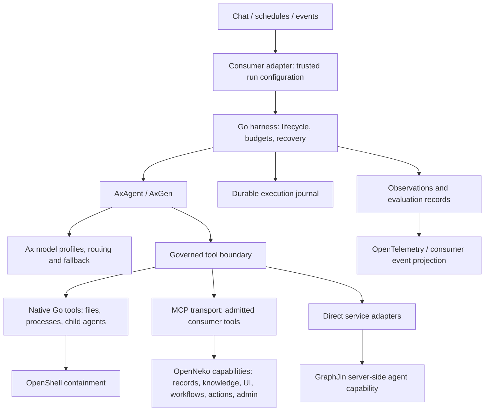

# Go Harness

Status: revised architecture and roadmap, 2026-09-20. M1–M4 are locally qualified
at their implemented scope; broad tool support and Hermes parity remain planned.

**Integration boundary:** build and package the harness independently. OpenNeko is the first consumer. Prefer its existing launch, policy, event and result contracts; keep compatibility in the adapter. A small, justified product integration change may be preferable to a permanent workaround and should be reviewed explicitly. Worker/web operation has evidence for the implemented slice; each additional capability needs its own acceptance gate.

This document records the current design direction, source findings, implementation notes, and questions to resolve. Proposed behavior is not a claim that Ax or OpenNeko already implements it. HTTP/Goja checks and isolated OpenShell/worker/web evidence now exist; see [milestone status](MILESTONES.md) for the qualified paths, accepted upstream cancellation limitation and later milestones.

The [building-block catalog](BUILDING-BLOCKS.md) inventories the general-purpose
runtime before any further feature selection. It distinguishes Ax primitives,
harness responsibilities, consumer adapters and currently qualified slices.

Detailed integration research: [OpenShell, broker and Ax compatibility](OPENSHELL.md). This covers the checked-in OpenShell version, credential replacement, transport requirements, multi-provider routing, broker recovery, sandbox lifecycle and required integration tests.

OpenShell **v0.0.116** has local qualification against the checked-in **0.0.54** baseline, with delayed upstream cancellation accepted as nonblocking. Released endpoint binding, managed-refresh handles and Docker OTLP tracing better support this design. Retain the existing host launcher initially: the new Go SDK has useful control/streaming APIs, but its tagged default file-transfer transport is unimplemented. See the companion document for release evidence, static-versus-managed rotation limits and rollout gates. No runtime upgrade has been performed.

## 1. Scope and agreed direction

- Build an independent Go harness; OpenNeko is the first consumer.
- Use Ax extensively for model access, routing, structured generation, context handling, and agent execution where its Go contracts fit.
- Support native Go tools, MCP tools and direct service adapters through one governed boundary. OpenNeko supplies its existing capabilities through the optional adapter.
- Delegate GraphJin lookups to its server-side agent as one capability; keep its investigation logic out of the core.
- Learn from Claude Code's execution invariants and Aithy's Ax integration.
- Make telemetry and evaluation part of every runtime capability from the beginning.
- Preserve the qualified M1–M4 foundation; next deliver the shared capability catalog and MCP integration before claiming Hermes parity.

The intended improvement is measurable reliability and task quality: recover safely, preserve intent, use evidence, expose progress, and spend model budget effectively. Feature count is not an acceptance criterion.

## 2. Architecture and ownership

Provisional choice: AxAgent owns the reasoning loop inside an application-neutral Go execution supervisor. The supervisor owns durable execution and governed access to tools. Do not create a second planner or independent retry loop around AxAgent.

| Owner | Responsibilities |
| --- | --- |
| Go harness | Run ownership, accepted inputs, operation records, authorization context, budgets, cancellation, durable checkpoints, recovery, neutral events |
| Ax | Provider normalization, model routing, typed generation, reasoning stages, runtime context management, supported model/tool telemetry |
| Tool transports | Adapt native callbacks, MCP and direct services without owning product policy |
| OpenNeko capability servers | Existing records, knowledge, interaction/UI, workflows, administration and integration contracts |
| GraphJin agent tool | Catalog-first discovery, governed lookups, evidence and typed investigation results |
| Consumer control plane | Identity, credential brokering, action requests, approval decisions, workflow scheduling, existing product persistence |
| Sandbox boundary | Filesystem, process and network containment; resource limits and process termination |

Preserve a trusted host/sandbox split. The optional OpenNeko adapter uses its existing host and broker. Production credentials and authoritative policy do not become model context or general-purpose runtime globals.

The **control plane** is the trusted consumer plus harness supervisor: identity,
capability admission, approval, budgets, scheduling, cancellation and durable
operation records. The **execution/data plane** is Ax's model/tool work, the
OpenShell-contained process and scoped files/artifacts. The broker supplies
short-lived access across that boundary. Bulk records and intermediate files stay
in the data plane; the model receives bounded references and evidence. This is a
trust and responsibility split, not a requirement for two Go services.

Fallback design: a custom Go model/tool loop using Ax's lower-level model APIs, only if AxAgent cannot expose the execution boundaries needed for recovery and governance. Prefer a focused upstream Ax extension over maintaining two competing engines.

### Consumer boundary

Keep the first integration to a versioned run specification, ordered events, one
terminal result, cancellation and scoped tool capabilities. The run specification
carries trusted instructions, input identity, approved model routes and limits;
model output cannot grant authority. Events carry run/attempt/operation IDs and
sequence numbers so adapters can correlate and deduplicate delivery. Terminal
results distinguish completed, failed and cancelled work; unknown external effects
remain explicit. Finalize concrete types with the first executable runtime slice.

GraphJin is an injected capability, not a database dependency. Product tenant
resolution, broker URLs, wire markers, job formats and business approvals belong
under `adapters/openneko`. The core imports no consumer adapter. Keep packages
static; no plugin registry or general plugin-loading system is required.

The standalone Ax/OpenShell suite must pass without any OpenNeko checkout. Product
acceptance is a separate layer using the real worker, broker and web app.
Existing product contracts are constraints on the adapter, not the harness API.

## 3. AxAgent findings and implications

### Reasoning stages

AxAgent's documented pipeline is distiller → executor → responder. The distiller narrows the request and evidence; the executor runs actor code against runtime values and tools; the responder produces the declared output. A direct-response path can skip the executor for suitable requests.

Large inputs can remain in runtime state with compact shape summaries in prompts. This is useful for structured GraphJin results, documents and calculations. It does not establish a security boundary against malicious source content: tool authorization must remain enforced by the host.

Implementation notes:

- Preserve the original request, explicit constraints and authorization outside model-generated distillation.
- Treat distilled requests and recalled memories as derived context, not authority.
- Measure latency, usage, errors and quality separately for each stage.
- Evaluate direct-response eligibility; live data requests must reach the relevant tool.
- Start with a small callable set; add discovery when catalog size warrants it.
- Keep the agent and its mutable runtime state owned by one run; do not share an AxAgent instance between concurrent tenants.

### Go API and runtime

The inspected Go implementation exposes state/session export, action and chat logs, usage, trace export, replay, and invocation-scoped runtime hooks. Optional Goja execution runs JavaScript actor code inside a Go application. Aithy itself is currently TypeScript/Bun, so its configuration is architectural evidence, not copy/paste Go API guidance.

Important limits found during source review:

| Finding | Design consequence |
| --- | --- |
| Context checkpoints summarize action history | They are not durable execution checkpoints |
| Go `ExportSessionState` / `RestoreSessionState` | Completed actor-step globals restore, but `Forward` restarts stages; failed `Forward` leaves no exportable session. See the executable [M4 boundary](M4-RECOVERY.md#ax-continuation-boundary). |
| Goja exports selected JSON-compatible globals, omits functions, and can truncate snapshots | Detect incomplete snapshots; keep critical state and large artifacts outside the interpreter |
| `ReplayTrace` checks recorded event/output fixtures | Build separate replay tests that exercise changed harness code against recorded dependencies |
| Context events are recorded in Go state; the reviewed file did not expose the documented `onContextEvent` or Aithy-style `onFunctionCall` names | Verify live Go hook coverage before relying on it; do not infer TypeScript parity |
| Runtime hooks and the usage observer are best-effort telemetry | Do not use them as the authoritative execution journal or sole budget gate |
| Embedded execution cannot guarantee termination of arbitrary noncooperative host callbacks | Use cancellation-aware tools and an outer process/sandbox termination boundary |

Never poll mutable Ax state concurrently to manufacture live telemetry. If a required callback is absent, use an owner-controlled boundary or add a supported hook upstream.

### GraphJin's server agent as an executor reference

The inspected GraphJin checkout (`a325face`) is a working Ax Go example, not
another harness dependency. Its `agent.Run` bounds the request and actor steps,
seeds catalog discovery before `AxAgent.Forward`, registers a small set of Go
callables, disables direct response for this data task, and keeps a per-run
protocol state. Its Goja wrapper carries narrowed
distiller evidence and the last authorized result into the executor without
copying large rows into prompts. The service derives caller capabilities from
identity, then enforces catalog visibility, mutation settings and core role/RLS
again where operations execute. A model-visible refusal cannot grant access.

Its final gate is as important as its tool gate: a failed mutation cannot become
an answered success, an answer needs observed evidence, and a tool-less finalizer
is attempted after step exhaustion only when the evidence is already sufficient.
The extra model call is included in usage. SSE action events are redacted progress;
the terminal response carries typed `answered`, `needs_clarification`, `blocked`
or `error` status, evidence, refusal, usage and trace identity.

For Harness, keep Ax's distiller/executor/responder in one run-owned actor and
place a generic governed invocation boundary under every callable. That boundary
owns admission, schema, policy, durable intent, execution receipt and bounded
model-visible result. Store large results behind scoped handles; hand the actor
only compact evidence and the original task constraints. A tool-less finalizer,
when justified, must reserve from the same run budget. A declined invocation
must say whether anything executed and give a bounded next step, while policy
denial remains final. Verify the actual receipts and artifacts before declaring
success. Do not copy GraphJin's catalog/query repair rules into Harness, unwrap
its server agent into low-level tools, or treat its in-process Goja session as a
durable checkpoint or sandbox. Stage routing must use explicit Ax metadata or a
single approved profile, not GraphJin's prompt-text stage detector.

The **Ax executor stage** writes JavaScript to compose admitted capabilities;
the **host executor** authorizes and dispatches each callable. GraphJin keeps
these separate in `agent/agent.go` (Ax setup and callable registration),
`agent/runtime_handoff.go` (run-local distilled evidence), and
`agent/protocol.go` (operation guards and final result checks). Follow that
separation in the general harness:

| Boundary | Harness executor contract |
| --- | --- |
| Before Ax | Freeze the accepted task, caller scope, capability bindings and hard budget. A catalog seed or prior answer may guide selection but grants no authority. |
| Distiller to actor | Expose bounded, run-local references and original constraints in Goja. Keep bulk observations in scoped storage, and do not serialize VM globals as a recovery checkpoint. |
| Each host callable | Validate the admitted schema and current policy; persist intent before external dispatch; execute through the appropriate native, MCP or direct adapter; save a typed receipt or explicit unknown outcome. Tell the actor whether a declined call executed. |
| After a callable | Feed bounded result/error and repair guidance back into Ax's next step. A successful prior receipt may be reused on resume; neither a model retry nor an API redelivery may repeat an ambiguous effect. |
| Terminal | Check task-specific success criteria against receipts and artifacts. A model's `final` or responder text alone cannot certify an effect or artifact. A tool-less rescue is allowed only with sufficient saved evidence and remaining budget, and re-enters the same gate. |

GraphJin's same-run catalog-detail guard is a good **domain verifier**, not a
universal prerequisite for unrelated tools. Its model-visible repair errors
show how to recover while the actor still has steps, but generic validation
should reject impossible inputs before dispatch instead of creating a retry
loop. The queued API run specification stays immutable after admission; work
needing fresh authorization pauses for an external decision or ends with a typed
`requires_action`/blocked result. It cannot silently edit the caller's queued
request to make an effect acceptable.

The current `internal/agent/run.go` already owns one bounded Ax run, pins a
trusted tool catalog and reuses durable operation receipts on continuation.
Its run-local Goja wrapper now carries JSON-bounded distilled evidence into
executor code as `harnessEvidence` across Ax's stage patch. The integration
fixture passes a large read result through the distiller, verifies the executor
uses its narrow reference without another read, and checks that the bulk value
does not enter the executor model request. The binding is redacted from runtime
inspection and snapshots; it is not a durable checkpoint. The runner now
turns failed or partial tool outcomes into a failed terminal result with a
safe answer, even when the responder claims success. It still has no general
evidence-qualified terminal gate for arbitrary answer claims. Add that check
where the real tool/result contract needs it, without
importing GraphJin's large domain protocol into the core.

Before broadening the executor, test a denied operation that produces no effect,
a completed operation whose final answer must cite its receipt, and step
exhaustion with sufficient versus insufficient evidence. Record per-stage model
calls, usage coverage, actor steps, tool outcomes and finalization cost. GraphJin
remains one admitted remote capability with its own internal executor and
authorization.

### Delegation, planning and verification

Ax Go already has `AxAgent.AddChildAgent` for owned child conversations and
`AxFlow` for application-owned typed graphs. Use the former for bounded specialist
delegation; child calls are serialized within the parent run. Use `AxFlow` only
when a task has a fixed dependency graph or genuinely independent work that
benefits from parallel execution. Parallel flows require owned client/program
workers and a concurrency check. Neither API is an OS process fork or a durable
copy of the parent's live stack. Each child receives explicit task context,
narrowed capabilities, a parent ID, shared budget and cancellation scope. A
transcript fork is not a prerequisite for delegation.

The parent may be an interactive Work turn, a queued workflow run, or an
agent job. A workflow has both a `workflow_run` (product outcome) and its
owning `work_run` (agent execution); children belong to that `work_run` and
carry the trusted workflow identity for trace and recovery. A child can
investigate an independent step and return evidence to the parent, but cannot
emit a workflow output or request an action unless the host explicitly grants
that exact capability. The parent verifies child evidence, publishes outputs,
and owns any governed action request. An API caller does not have to remain
connected or approve a child spawn: the queued run uses its admitted actor,
policy, budget and cancellation scope. Actions that require approval follow
the existing asynchronous action-request lifecycle, not an interactive pause
in the child. Resume joins recorded child results and does not repeat an
ambiguous effect.

The currently qualified Ax child is an inline, bounded investigation inside
one queued `work_run`: it has a separate conversation and capability set, but
is recorded as a child span and cannot outlive that run. This covers the
current workflow use cases. A separately queued child `work_run` is warranted
only when a concrete workflow needs a child to progress independently across a
long wait, be scheduled in parallel with other work, or have its own retry and
budget. If that need appears, use the existing queue and link the child to its
parent and `workflow_run`; pin its task, actor, capabilities and idempotency key,
then join its recorded result. Do not add this second scheduling path for M5.

For complex tasks, the agent may produce a small, inspectable plan of outcomes,
dependencies and evidence needed. AxAgent retains the adaptive reasoning loop;
the supervisor records the plan as derived task state and orchestrates governed
operations. Simple requests can execute directly. Completion has a separate
verification gate: check required tool receipts, artifact existence/schema and
task-specific invariants against actual outputs before declaring success. A model
review can help assess ambiguous quality, but cannot substitute for these checks.
This makes plan → execute → verify visible without adding a second planner loop.

## 4. Tool capability and transport contracts

GraphJin is one admitted tool family. The harness runs the same validation,
authorization, operation recording, execution, result and telemetry pipeline for
native Go callbacks, MCP calls and direct service adapters. MCP standardizes the
wire interface; it does not establish authorization or safe retry semantics.

### Catalog and prompt consistency

The trusted consumer supplies the eligible capability set for a particular actor,
run kind, channel and data surface. Bind each admitted tool to stable identity,
schema/version, origin, limits, effect classification and recovery behavior.
Descriptions, MCP annotations and model arguments cannot expand that set. Unknown
classification is conservative: no assumed read-only concurrency or effect retry.
Pin the admitted catalog for the attempt; changed schemas or permissions require
revalidation before dispatch or recovery. Handle name collisions explicitly.

OpenNeko's actual surface includes records, memory/library, skills, clarification,
UI rendering, workflows/rules, plugin/pack actions and administrative tools, in
addition to GraphJin. Workflow-specific output/action tools require a trusted
workflow identity. Batch runs are workflow executions: the definition owns the
batch contract, `workflow_run` owns the trigger and result, and `work_run`
owns the agent transcript and artifact. A workflow may use any number of skills
or none. Skills provide instructions and files; they cannot invoke a model
provider directly. Every model call must cross Harness/Ax routing, budget,
policy and telemetry. File/terminal execution and native child agents are not MCP
requirements. The [milestone capability inventory](MILESTONES.md#capability-coverage-to-deliver)
is the scope of product qualification.

Assemble instructions from the same admitted catalog used for execution. Reuse
OpenNeko's conversation, evidence, workspace and channel contracts, but replace
Hermes-specific names and native delegation instructions with available bindings.
Do not copy the Hermes prompt wholesale. Tool descriptions and installed skills
remain contextual instructions, not policy. The current read-only Harness prompt
and `mcpTools: false` represent the remaining implementation gap beyond the
qualified search-only memory and library reads, not the target architecture.

### MCP integration and credential boundary

Reuse the existing OpenNeko logical servers and multiplexed bridge, not their
business logic. Qualify Go/Ax discovery and calls against the real bridge, including
pagination, schemas, structured/text results, tool errors, progress, deadlines,
cancellation and lifecycle. Use existing supported protocol code; implement only
transports/features required by admitted tools, explicitly rejecting unsupported
ones. Trusted host configuration owns bridge executables, arguments and endpoints.

The bridge and broker credentials must be inaccessible to arbitrary model-generated
subprocesses. An environment variable whitelist alone is not isolation. Before
shipping shell tools, prove a trusted host/isolated bridge path with the same actor
scope and existing OpenShell network restrictions. A tool result containing a URL
or server instruction cannot authorize a new connection or process.

### Effects and continuation

Classify behavior per operation, not transport: reads, local mutations, durable
product/external effects, interaction waits and UI projections need different
recovery policies. Preserve M4's intent/result records, claims, exact-argument
approvals and unknown-outcome handling. A remote MCP handler may commit before its
reply; place durable protection at that real effect boundary. Do not infer
idempotency from `tools/call`, annotations, or an HTTP success code.

Reuse the consumer's approval system. Persist clarification/approval references;
resume without repeating user questions, cards or committed effects. Keep legacy
fence compatibility inside the adapter and prevent duplicate fence/tool execution.
Do not enable capabilities by broadening a restricted broker token to all routes.

### GraphJin delegation contract

Use the existing server-side GraphJin agent capability through OpenNeko's broker. OpenNeko already has `/v1/graphjin/agent`, which calls the server's HTTP agent API after readiness and read-only checks. GraphJin also exposes `ask_graphjin_agent` through MCP with history, optional retained task IDs and progress notifications; those broader capabilities are not all forwarded by the current broker route. Caller identity remains server-derived; model credentials remain GraphJin-owned.

The harness sends a focused investigative question and relevant constraints. GraphJin owns discovery and query planning. The harness consumes status, answer, data, evidence, refusal, notices, usage and trace correlation as structured values.

Implementation notes:

- Preserve `needs_clarification`, `blocked` and error outcomes; do not flatten them into a successful prose answer.
- Do not route around a GraphJin refusal through shell or direct HTTP access.
- Propagate authenticated caller scope through the existing broker boundary. Model-supplied tenant or namespace values must not establish identity.
- Attach a parent operation ID and propagate trace context where supported; otherwise record a link to the returned GraphJin trace ID.
- Separate transport failure from a completed investigation returning a refusal or insufficient evidence.
- Record outer and remote budgets separately until coordinated budget propagation is proven. Parent cancellation does not by itself prove remote work stopped.
- Use progress notifications for display, not as a durable source of execution truth.
- Keep bulk data in scoped artifacts/runtime values and carry bounded evidence references into prompts.

## 5. Execution invariants

1. Every committed model tool call has exactly one terminal model-visible result, including denial, validation failure, cancellation and unknown execution outcome. Do not dispatch partial streamed calls.
2. Transcript pairing does not imply exactly-once external effects. Record stable operation IDs and execution intent before dispatch; reconcile ambiguous outcomes instead of blind replay.
3. One owner serializes state transitions. Worker results return to that owner, and late results cannot mutate a closed run.
4. Authorization and sandbox containment are distinct. Tool schemas, discovery metadata and prompts cannot grant capabilities.
5. Approval binds to the exact operation, arguments and authorization scope; execution rechecks applicable policy.
6. Run proven-safe reads concurrently; serialize mutations initially. Unknown tools and arbitrary shell commands are not presumed read-only. Cross-run shared resources require their own concurrency protection.
7. Existing-file edits require a read version/freshness check. Coordinate check-and-write for harness-owned writers; external editors remain a concurrency concern to test explicitly.
8. Accepted inputs are deduplicated by stable IDs. Retrying a delivery must not append another user message or repeat completed effects.
9. Retries, corrections, recursion and compaction consume bounded run budgets. Assign retry ownership explicitly across Ax, transport, tool and job layers.
10. Report completion only after required tools and artifact checks finish. Model prose cannot establish that an action succeeded.

Ax-native calls and actor-code callbacks must both pass through the governed boundary. A single actor step can execute several effects, so checkpointing only after the step is insufficient.

## 6. Lifecycle and durability

Proposed run states: queued, running, waiting for input, waiting for approval, waiting for external work, completed, failed, cancelled, and outcome unknown. Waiting states are durable continuations and should not hold model calls open.

Keep separate identifiers for thread, run, execution attempt, model attempt, tool operation and remote delegation. A resumed run gets a new execution attempt while retaining its logical operations.

A durable checkpoint should include:

- Schema version, Ax version, harness version and program/configuration identity.
- Accepted input IDs, current lifecycle state and durable event cursor.
- Original request and explicit constraints; references to derived context.
- Ax agent state and separately identified runtime snapshot, with completeness checks.
- Tool operation ledger, pending approval/continuation IDs and unresolved effects.
- Artifact references, file versions and budget accounting with coverage status.

Define journal/checkpoint semantics in the harness, with persistence supplied at the host boundary. The OpenNeko adapter may bind its existing database and queue without importing application schema or queue types into the core. Prefer transactional journal/checkpoint updates and scoped artifact storage over unbounded transcript files. Snapshots should accelerate recovery; they must not silently discard unreconciled operations.

The focused Go compatibility evaluation found that Ax snapshots do not preserve a `Forward` execution cursor. The implemented [recovery contract](M4-RECOVERY.md#ax-continuation-boundary) therefore uses host-owned operation evidence and explicit bounded new Ax attempts. It does not restore an old JavaScript stack.

Lifecycle hooks also change working state. At owned boundaries such as input
acceptance, after a tool result, child join, compaction and before the next model
turn, a hook may update the plan, evidence references, context or next-turn
guidance. Ax Go's `AxRunControl.Steer` queues scoped guidance and reports when it
is applied; AxAgent also exposes state/session export and restore. Apply state
changes through the run owner at a documented safe boundary, never by concurrently
mutating a running AxAgent. Persist any change needed after recovery before the
next dependent model request, and test that a resumed run sees it exactly once.
The pinned Go build has a local fixture proving that `AxRunControl.Steer`
queued by a host tool callback enters the next model request once. Its
`AxRuntimeHooks` surface contains rate limiting, tracing and metering, not a
state-mutation callback. A production state hook therefore belongs at the
harness-owned result boundary, with a durable state projection and replay rule;
the Ax control alone is not the journal.

There are separate hook effects: **state transitions** may change agent working
context, **policy gates** may deny a proposed operation, and **observers** emit
progress or telemetry. Ax's invocation-scoped rate-limiter, tracer, meter and
usage observer cover model execution; the observer hooks are best-effort. The
trusted harness still owns authorization, required checkpoints and the durable
effect journal. A failed required state update stops the dependent transition;
an observer failure records telemetry loss. A state hook cannot expand the
admitted tool set or rewrite a completed effect. Add user-configurable hooks
when a concrete integration needs them, under these same rules.

Ax's event runtime may later adapt authenticated wakes and continuations, but
must not create a second authoritative inbox or operation journal alongside the
consumer scheduler and harness recovery ledger. Qualify that integration against
the pinned or upgraded Go release before using it.

Recovery must distinguish:

- No external dispatch: safe to retry within budget.
- Completed effect with persisted result: reuse the result.
- Dispatch occurred but outcome was not durably recorded: reconcile using an idempotency/status contract, or mark outcome unknown.
- Changed policy, incompatible state version or incomplete snapshot: stop safely with an explicit recovery reason.

## 7. Model routing and budgets

Route by known work boundary and Ax stage, not by guessing the difficulty of an
entire user request. Keep approved logical profiles such as `fast`, `balanced`
and `hard`. Ax Go supports `contextOptions`, `executorOptions`,
`responderOptions` and an `executorModelPolicy` option for ordered entries
triggered by consecutive error turns or matched tool namespaces. The current
Harness uses the verified stage controls and Ax provider routing within the
approved profile. A live fault-injection test against the pinned Ax Go build
found that it accepts `executorModelPolicy` but does not apply it during agent
execution. Keep error-turn escalation disabled until an upgraded Ax build or
another implementation passes a live route trace. When enabled, escalation
must change only later model calls; it cannot expand grants or retry an effect.

GraphJin lookups cross into a separate, server-owned Ax agent. Configure that
GraphJin deployment with the `hard` model/reasoning profile because the host
cannot reliably predict how much schema discovery and query reasoning the
lookup will require. The Harness submits the instruction and caller scope, not
a per-request model override. GraphJin currently resolves `agent.provider`,
`agent.model` and `agent.reasoning` in its own server config; it has no public
per-lookup difficulty mode. Account for its remote usage and latency in the
parent budget and telemetry.

Skill selection is a different boundary: exact-name or metadata lookup should
remain deterministic; semantic selection, if needed, can use an approved
`fast` model through Harness/Ax. A skill file never calls a model directly.
Similarly, a cheap distiller or responder may be appropriate when the difficult
work has already produced verified evidence. The executor starts on the
approved baseline. Escalation on observed difficulty remains a verified-runtime
requirement, not an active route today.

Ax's operational balancer is not semantic task-to-model selection. The
application binds the work boundary and allowed profile; Ax selects an
eligible provider/model deployment within it.

Every candidate route must satisfy capability, tenant policy, data residency and provider approval requirements. Failover must preserve those constraints and provider transcript compatibility. Do not switch providers in the middle of an unresolved tool sequence without a valid continuation strategy.

Budget model attempts, tokens/cost, actor steps, tool operations, wall time and child work. Use reservations/admission controls and reconciliation for hard limits. Unknown usage is not zero. Do not independently retry at every layer and multiply attempts accidentally.

For variable task size, evaluate a Jev-style Ax Go decision at admission for
**budget allocation only**, independently of stage/capability model routing: classify
an approved, bounded task summary and trusted metadata into a few workload tiers
(short answer, multi-step investigation, artifact/data pipeline, uncertain).
Map the class to an initial budget profile for model calls, tool operations,
tokens/cost and wall time. The pinned Ax Go package already exposes
[`Typesafe(...).SystemOne`](https://axllm.dev/go/skills/ax-go-typesafe/) for
typed choices and probabilities; no generative planning pass is needed for this
decision. The trusted host sets the run-wide ceiling and eligibility first.
Classification may allocate within that ceiling, never raise it or grant tools.
Use the class distribution to avoid under-budgeting ambiguous tasks; do not
reduce a bimodal result to its average class.
Low confidence, missing classifier service or disallowed data transfer uses the
existing fixed host default. At durable checkpoints, the host may extend the
initial allocation within the same ceiling using observed progress; it records
the reason and remaining budget so restart cannot reset or multiply it.

## 8. Telemetry contract

Telemetry is a required part of each capability's acceptance criteria. Own a neutral observation and usage schema in the harness. Export through OpenTelemetry and map to OpenNeko's `HarnessObservation` and `NormalizedUsage` only in its adapter, with conformance fixtures. No product telemetry package is a core dependency.

### Three connected records

| Record | Purpose | Delivery requirement |
| --- | --- | --- |
| Execution journal | Recovery, approvals, effect reconciliation | Durable; required before the relevant state transition/effect |
| Operational observations | Production diagnosis, metrics and trace navigation | Bounded asynchronous export with explicit loss/coverage signals |
| Evaluation records | Explain quality failures and compare implementations | Scoped retention and access; redacted content only where needed |

Operational telemetry is content-free by default. Do not export prompts, raw reasoning, tool arguments/results, SQL, credentials or full Ax trace dumps into ordinary spans or metrics. Evaluation fixtures may contain approved/redacted task content under separate access and retention controls.

### Required instrumentation

| Boundary | Measurements and events | Improvement question |
| --- | --- | --- |
| Admission | Queue delay, workload category, run/attempt IDs, configuration versions | Are latency and failures caused by capacity? |
| Context/distiller | Input size, evidence size, pressure, compaction/checkpoint events | Are we losing intent or wasting context? |
| Model attempts | Stage, logical profile, actual model/provider, first chunk, duration, usage, validation/correction count | Which models and prompts work best? |
| Routing | Candidate/selected routes, fallback category, cost/deadline scores | Does routing improve outcomes under constraints? |
| Budget triage | Classifier/version, class, confidence band, chosen profile, latency, allocation changes and exhaustion | Does dynamic allocation improve verified completion per unit cost without premature cutoffs? |
| Actor runtime | Step count, duration, errors, repeated operations, snapshot completeness | Is the agent looping or losing working state? |
| Tools | Stable identity/schema, native/MCP/direct transport, validation, policy, approval wait, dispatch, outcome, payload sizes | Are tools understandable and reliable? |
| GraphJin | Remote status, latency, trace link, usage coverage, clarification/refusal category | Is data delegation effective? |
| Memory/skills | Retrieval latency, selected version IDs, load/use counts | Does retrieved guidance help? |
| Recovery | Checkpoint age, recovery reason, unresolved effects, cancellation-to-quiescence time | Can work resume safely? |
| Output | Contract checks, verified artifact count, actual outcome, feedback | Did the task succeed? |
| Export pipeline | Dropped observations, queue saturation, export errors, missing operation ends | Can we trust our measurements? |

Use OpenTelemetry spans for operation hierarchy and events for transitions. Keep run/user identifiers in trace or journal fields, not unbounded metric labels. Separate model first-token latency, first useful user-visible output and full task completion time. Record approval wait separately from active execution.

Prefer invocation-scoped Ax tracer/meter hooks. Register a single process-wide usage observer at startup with explicit per-call attribution; never replace that observer per tenant or per run. Verify that propagation reaches stages, recursive queries, child agents, tools and fallback attempts.

Do not assume every tool path emits a span because one path does. Instrument the governed dispatch boundary and correlate Ax spans without creating duplicate accounting events.

### Usage and cost

- Record every model attempt, even when provider usage is missing.
- The Go limiter now journals a content-free start and finish for each admitted
  model request. A finish carries only Ax-normalized token counters; the terminal
  aggregate counts missing reports and survives bounded resume. OpenNeko projects
  that aggregate as outer-model usage, separate from GraphJin's remote usage.
- Ax's completed-call observer may emit nothing for missing usage or an incompletely consumed stream. Preserve `complete`, `partial` and `unavailable` coverage.
- Keep provider observations distinct from estimates. Calculate estimated cost with a versioned pricing table; billed cost is separate when available.
- Count each model attempt once. Stage, agent and parent totals are rollups, not additional billable events.
- Link GraphJin usage as remote child work; do not add both remote per-call events and its aggregate again.
- Give accounting events stable identities for deduplication across ingestion retries.
- Telemetry exporter failure must not break ordinary execution. Execution journal or mandatory budget-control failure must not silently permit unrecorded effects or unlimited spending.

### Sampling and retention

Retain durable lifecycle and effect records regardless of trace sampling. Aggregate metrics should not depend on sampled traces. Use bounded trace capture, with configurable retention for failures and representative successes. Record sampling policy with evaluation cohorts so comparisons are not based only on failures.

## 9. Evaluation and improvement

Persist a reproducibility manifest per run: harness commit, Ax version, prompt/signature versions, model profile and actual route, context preset, tool schemas, skill/playbook versions, sandbox image and experiment assignment.

Keep task success distinct from process success. A valid JSON response or successful HTTP call does not establish a correct answer. Outcome records should distinguish completed, partial, blocked, cancelled, failed and unknown, with the source of judgment: deterministic check, user feedback or evaluator.

Improvement loop:

1. Sample failures and representative successes.
2. Curate redacted tasks with expected outcomes and tool/model fixtures where appropriate.
3. Run deterministic harness regression tests separately from live-model quality evaluations.
4. Compare variants on the same task cohorts and held-out cases.
5. Score correctness, evidence support, policy compliance, latency and cost together.
6. Promote versioned changes only when improvements survive regression checks; retain rollback capability.

Initial experiments: context preset, model per stage, direct-response eligibility and GraphJin delegation granularity. Track cost per verified successful task, not only cost per model request. Report sample size, uncertainty and usage coverage. Do not treat noisy model-judge scores as ground truth.

Ax playbooks and optimization can improve bounded programs offline. Learned guidance must not alter identity, authorization, sandbox permissions or factual authority. Disable automatic production evolution until evaluation and promotion gates exist.

### Claude Code deep-dive cross-check (2026-09-26)

The [Inside Claude Code](https://y-agent.github.io/inside-claude-code/) series is a useful source-derived architecture map, not a normative implementation contract. It describes a particular Claude Code build; some details conflict even within the series (its [compaction chapter](https://y-agent.github.io/inside-claude-code/04-context-compaction.html) says the summarizer uses the parent model, while its [transparency chapter](https://y-agent.github.io/inside-claude-code/14-hidden-costs-context-manipulation.html) says Haiku). Copy invariants only after checking them against the harness's own tests and Ax/OpenShell contracts. Its numeric thresholds, cache protocol, classifier and large hook/flag systems are not requirements for us.

| Practice from the deep dive | Current plan / evidence | Next proof or adjustment |
| --- | --- | --- |
| One engine with structured events; adapters own CLI, SDK or remote presentation ([architecture](https://y-agent.github.io/inside-claude-code/00-birds-eye-architecture.html), [SDK I/O](https://y-agent.github.io/inside-claude-code/15-agent-sdk-structured-io.html)) | Independent Go supervisor plus optional OpenNeko adapter; M1–M4 have ordered events and durable operation evidence | Keep the event projection distinct from the execution journal; verify replay, duplicate delivery and one terminal result as new surfaces arrive. |
| Complete tool calls and terminal results survive denial, failure and cancellation; safe reads overlap while writes form barriers ([agent loop](https://y-agent.github.io/inside-claude-code/02-agent-loop-query-engine.html), [tools](https://y-agent.github.io/inside-claude-code/05-tool-system.html)) | M1/M4 cover the first paths; invariant 1 and the conservative scheduler are already specified | Extend pairing and concurrency tests to every newly admitted MCP/native tool. Streaming may overlap execution only after that individual call is fully parsed and admitted. |
| A small core tool set plus deferred schema discovery keeps large catalogs out of every prompt ([tools](https://y-agent.github.io/inside-claude-code/05-tool-system.html)) | M5a pins a run-scoped catalog; most OpenNeko capabilities remain unadmitted | In M5b/M6 measure per-turn schema tokens and discovery misses. If material, expose a search/describe projection **of the already admitted catalog**; loading a schema never grants authority. Keep frequent tools eager. |
| Stable prompt prefix, volatile MCP/runtime details late, and staged output eviction preserve cache use and context ([prompt](https://y-agent.github.io/inside-claude-code/03-prompt-assembly.html), [compaction](https://y-agent.github.io/inside-claude-code/04-context-compaction.html)) | M6 specifies bounded references, budgets and intent-preserving compaction; M5b batch files are planned | Prioritize M5b query-to-file before elaborate summarization. Then measure actual prompt/cache tokens, offload stale observations before summarizing, and verify original request, constraints, pending effects and artifact handles survive compaction/restart. Use provider-specific cache features only when Ax exposes them reliably. |
| MCP connection and tool metadata are dynamic; the permission pipeline must also cover remote tools ([MCP](https://y-agent.github.io/inside-claude-code/10-model-context-protocol.html), [hooks](https://y-agent.github.io/inside-claude-code/11-hooks-lifecycle.html)) | M5a pins schemas and admission; M5b has two read routes on the real bridge; M4 journals external effects | Test bridge death/reconnect and catalog drift without blindly replaying effects. MCP annotations and server instructions remain untrusted hints. Add lifecycle state-update hooks at owned boundaries; add user-programmable hooks only for a demonstrated integration need. |
| Permission policy and process containment are separate; telemetry and compaction must be inspectable ([safety](https://y-agent.github.io/inside-claude-code/06-safety-sandbox.html), [transparency](https://y-agent.github.io/inside-claude-code/14-hidden-costs-context-manipulation.html)) | OpenShell/broker qualification, durable journal, usage coverage and content-free telemetry already lead here | Report actual route, context size, compaction events, tool outcomes and usage coverage per run; validate broker grants and OpenShell restrictions for each new tool. Do not copy a shell classifier, hidden feature-flag matrix or a content-heavy telemetry feed. |

The largest remaining performance gap is not a missing Claude Code mechanism: it is M5b's governed file-backed batch path. The 2026-09-15 lead-union comparison showed the script's per-query agent mediation consuming far more turns than Reckon's batch run. Success here is a validated CSV with bounded model context and a trace showing query receipts, not merely fewer tokens in a synthetic conversation. After that, M6 prompt/schema budgeting and compaction can be evaluated on the same task cohort.

### Toolkit inventory from current Claude Code (2026-09-26)

Use the current [Claude Code tool reference](https://code.claude.com/docs/en/tools-reference) as a checklist of *task capabilities*, not an SDK integration or a set of APIs to call. Its exact tools vary by session. Our own Go toolkit inventory, priorities and verification targets are in [BUILDING-BLOCKS.md](BUILDING-BLOCKS.md#toolkit-inventory). The most valuable gaps for us remain file-backed batch execution, an isolated process/workspace, artifact delivery and selective discovery of the run's already admitted OpenNeko tools. Claude's [lazy tool search](https://code.claude.com/docs/en/agent-sdk/tool-search) and [bounded background work](https://code.claude.com/docs/en/tools-reference) are useful design evidence; our host owns those lifecycles and policy regardless of model/provider.

## 10. Implementation sequence and acceptance gates

The actionable delivery plan is [MILESTONES.md](MILESTONES.md), with deliverables, verification scenarios, dependencies and exit gates for each milestone. The sequence below summarizes the capability areas; OpenShell qualification now precedes the first integrated run in that plan.

Verification progressively includes actual services: HTTP transport in M1, worker/queue plus OpenShell in M2, and the existing browser/web flow through worker, sandbox, broker and real GraphJin in M3. Every later milestone extends that end-to-end suite with its failure and recovery cases. Unit tests alone do not satisfy milestone acceptance; browser-visible outcomes, durable records and actual execution must agree.

1. **Retained foundation (M1–M4):** Ax contracts, OpenShell, the first GraphJin slice and durable governed operations.
2. **Shared capabilities (M5a):** common catalog/dispatch, prompt consistency and versioned recovery across tool types.
3. **Local foundation (M5d/M6):** file/process containment, bounded output,
   model routing and pre-call budgets against isolated fixtures. Connected artifact
   publication is verified later.
4. **MCP and product tools (M5b/c):** once an OpenNeko/GraphJin instance is
   connected, qualify real batch reads/UI/clarification, then each workflow/action/admin
   effect family using existing OpenNeko handlers.
5. **Routing and context (M6):** Ax profiles, bounded retries, observation references, compaction and total usage accounting.
6. **Delegation (M5e):** bounded child instances with narrowed capabilities and shared budgets.
7. **Parity and rollout (M7/M8):** full capability inventory, held-out quality checks, staging and rollback.

Required proof before treating AxAgent as the production foundation:

- Every committed call reaches one terminal result on success, denial, validation failure, cancellation and crash recovery.
- A crash after an external effect does not automatically repeat it.
- Live model/tool/context telemetry is correlated across every supported execution path.
- Simultaneous tenant runs do not share mutable agent state, credentials or attribution.
- Missing usage remains visible; aggregate accounting does not double count.
- Exporter outages and queue saturation are observable without blocking normal model calls.
- Snapshot truncation and incompatible versions are detected before resume.
- Noncooperative tool work cannot mutate a closed run; cancellation latency is measured.
- Provider fallback preserves policy and a valid transcript.
- Compaction preserves explicit constraints and references needed to finish the task.
- Read concurrency, mutation exclusion and file freshness are demonstrated under contention.
- Final output and artifacts satisfy deterministic checks where possible.

## 11. Implementation decisions to close at their milestone

- M5a: the local Ax catalog now pins schemas and a run catalog hash, preserves
  operation identity and old four-operation checkpoints, and admits local MCP
  read fixtures through the official SDK. M5b has connected the actual OpenNeko
  bridge for search-only memory and library reads; the broader transport and product
  surface remain open.
- M5b/d: qualify the existing MCP bridge transport and trusted process placement
  before exposing shell access; prove broker credentials are inaccessible to children.
- M5c: inventory each actual mutation handler's approval, persistence and recovery
  semantics. Existing M4 qualification does not automatically cover every MCP tool.
- M6: coordinate budgets and trace propagation across all remote/child tools;
  preserve unavailable usage and prevent aggregate double counting.
- M7: freeze the parity inventory, quality thresholds, deployment retention and
  any explicit canary exclusions before evaluation.

Ax is already pinned and bounded continuation is established by M1/M4 evidence.
Do not reopen those choices without a concrete missing contract. Delayed upstream
OpenShell cancellation is accepted as nonblocking; adopt its eventual upstream fix.

## 12. Source notes

Research was performed on 2026-09-19. Ax main was observed at `5c43344f9ef3016db576fa2c3b59d48ef21b4d71`; individual reads used main URLs, so pin and recheck the selected implementation revision before coding. Local OpenNeko and GraphJin findings describe the inspected checkout, not necessarily a deployed release.

The GraphJin executor reference was rechecked on 2026-09-27 at local commit
`a325face`: `agent/agent.go` (Ax construction and finalization),
`agent/protocol.go` (evidence and execution guards), `agent/runtime_handoff.go`
(run-local stage handoff), `serv/agent_runtime.go` (service authorization), and
`serv/agent_http.go` (identity and streamed result).

External references:

- [AxAgent internals](https://axllm.dev/go/agents/internals/): stages, context objects and compaction.
- [Ax Go agent subsystem](https://axllm.dev/go/subsystems/agent/): runtime/tool integration.
- [Ax Go implementation](https://github.com/ax-llm/ax/blob/main/packages/go/axllm.go): API, state, replay and hooks.
- [Goja runtime](https://github.com/ax-llm/ax/blob/main/packages/go/runtime/goja/goja.go): snapshot and execution limits.
- [Ax telemetry](https://axllm.dev/go/concepts/telemetry/): runtime hooks, accounting and routing events.
- [Ax model routing](https://axllm.dev/go/concepts/llms/): model keys versus operational balancing.
- [Ax event runtime](https://axllm.dev/go/concepts/event-runtime/): continuations and generated-language persistence boundaries.
- [Aithy agent construction](https://github.com/dosco/aithy/blob/main/src/agent/create-agent.ts): application composition using Ax.

Local integration and reference points:

- `../../Open-Neko/OpenNeko/packages/llm/src/agent-backend.ts`: current backend/product event contract.
- `../../Open-Neko/OpenNeko/packages/llm/src/work/run-chat-turn.ts`: context ownership, backend selection and host lifecycle.
- `../../Open-Neko/OpenNeko/packages/llm/src/sandbox-runtime.ts`: sandbox-safe runtime surface.
- `../../Open-Neko/OpenNeko/packages/telemetry/src/types.ts`: observation and usage contract.
- `../../Open-Neko/OpenNeko/packages/telemetry/src/opentelemetry.ts`: existing OTel projection.
- `../../Open-Neko/OpenNeko/packages/telemetry/src/redaction.ts`: content exclusion and redaction.
- `../GraphJin/serv/mcp_agent.go`: server-side agent tool and progress.
- `../GraphJin/agent/agent.go`: typed request, response, usage and trace fields.
- `claude_code/src/query.ts`: tool/result pairing and model loop reference.
- `claude_code/src/services/tools/toolOrchestration.ts`: read-parallel/write-exclusive scheduling reference.

The Claude Code directory is a source reference, not a verified buildable upstream checkout. None of these sources alone establishes production readiness for the proposed harness.
