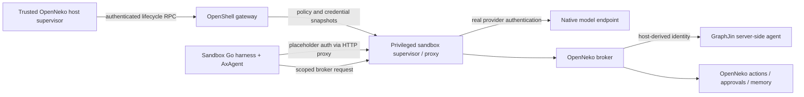

# OpenShell integration with the Go/Ax harness

Status: design research, 2026-09-19. Companion to [DESIGN.md](DESIGN.md).

Scope: generic transport/security findings apply to the standalone harness.
OpenNeko-specific broker, launcher, persistence and rollout findings describe the
optional consumer adapter, not core dependencies. Suggested product-side changes
are research gaps to evaluate against adapter complexity; no such changes are
part of the current organization pass.

Evidence levels used below:

- **Source-verified:** inspected local OpenNeko code, Ax Go code, or OpenShell's tagged source.
- **Documented upstream:** current NVIDIA documentation; not proof of availability in OpenNeko's pinned version.
- **Proposed:** implementation direction that still needs integration tests.

Research below is supplemented by [M2's initial live compatibility results](../integration/README.md). A separate 0.0.116 test gateway/sandbox now passes synthetic HTTP credential and policy checks; the active application stack was not changed and no real-provider credentials or requests were used. Read-only worker/queue/browser gates now have local evidence in [M3 acceptance](../integration/openneko/README.md); M4 recovery also has [live acceptance evidence](M4-RECOVERY.md). Upstream idle-stream cancellation is an accepted nonblocking limitation as of 2026-09-20; provider work may consume additional tokens until closure or sandbox teardown.

### OpenShell 0.1.2 migration gate (2026-10-02)

OpenNeko main now uses 0.1.2. The standalone transport suite
now qualifies a matched 0.1.2 CLI/gateway/supervisor tuple, as recorded in
[integration/README.md](../integration/README.md#isolated-012-qualification-2026-10-02).
The feature-branch consumer uses the 0.1.2 CLI directly. The legacy
`adapters/openneko/cmd/openshell-compat` remains restricted to 0.0.116.

The breaking boundary is primarily 0.1.0, which 0.1.2 includes. The
[official upgrade guide](https://docs.nvidia.com/openshell/upgrade/0-1-0)
says 0.0.x installations cannot upgrade in place, 0.0.x sandboxes must be
recreated, and mixed 0.0.x/0.1.x peers are unsupported. It also requires
schema-v2 gateway configuration, explicit provider-profile import, explicit
provider attachment, and updates to authored policy and SDK contracts. The
[0.1.2 release](https://github.com/NVIDIA/OpenShell/releases/tag/v0.1.2)
adds fixes on top of that boundary; its short release notes are not a migration
guide.

For our CLI-based path, these are the exact qualification surfaces:

1. **Passed standalone:** generate certificates and start the gateway with
   schema-v2 configuration; check readiness and telemetry without touching an
   existing gateway.
2. **Passed with a synthetic profile:** explicitly import profiles, create and
   attach providers, and prove `openshell:resolve:env:…` replacement at the
   intended destination plus denial elsewhere. Rotation, detach/reattach,
   managed refresh, and two provider slots passed. The connected OpenNeko
   profile and credential replacement now pass as well.
3. **Passed:** the standalone policy and built image run under 0.1.2,
   including streamed HTTP/HTTPS, cancellation and sandbox deletion. The
   connected consumer passes sandbox create/upload, policy, Ax routing and
   fallback, streaming first content, and cold/warm/reused Hermes turns.
4. **Remaining:** repeat the broader worker/queue, workflow and rendered-web
   gates on 0.1.2 before calling the entire consumer suite qualified.

The connected crash-and-resume gate now uses `sandbox stop` followed by
`sandbox start`. OpenShell 0.1.2 preserves the workspace across that process
interruption, so the host can inspect the interrupted checkpoint and resume
without repeating broker effects. Killing the whole Docker sandbox container
loses that workspace; disconnecting the CLI leaves its remote exec running.
Neither is an equivalent recovery test. The stop/start gate passed with one
saved GraphJin lookup and one saved workflow-output receipt, one resumed run,
and inert queue redelivery.

The connected migration found three concrete differences: OpenShell 0.1.2
rejects `sandbox create --upload` with a command, provider profile `env_vars`
must name the workload destination (`api_key`), and the warm Hermes server
must tolerate denied process-group cleanup after a fork exits. The warm
launcher keeps its attached stream open and serializes policy and input
binding. The official guide also changes mutation
retry semantics: admitted work can outlive cancellation, so a failed exec or
delete must be reconciled using the same request identity rather than blindly
reissued. See the [0.1.0 upgrade guide](https://docs.nvidia.com/openshell/upgrade/0-1-0)
for the exact contract.

## 1. Recommendation

Run AxAgent and its Goja actor runtime inside an OpenShell sandbox. Keep the consumer's trusted control plane, persistence, authorization and broker outside. Let Ax select approved native provider routes, and let OpenShell substitute provider credentials on inspected outbound HTTP traffic.

Retain the existing broker for GraphJin and product operations. A Go harness does not require rewriting the TypeScript control plane. Use a small Go client for its existing HTTP contract, with the recovery and authorization additions described below.

Do not use a gateway-wide `inference.local` route as the default for multi-provider Ax balancing. Do not transplant Hermes' provider names, Python executable allowance or environment aliases unchanged into the Go runtime.

## 2. Version boundary: an implementation prerequisite

**Source-verified:** OpenNeko's Dockerfile and both development/packaged Compose defaults select OpenShell `0.0.54`. Environment overrides may change actual deployments; no live version was inspected. The tagged source inspected for `v0.0.54` resolves to `79aa355dd008e496a7d8f97b361a7b2866066fbc`.

**Documented upstream:** current documentation identifies `0.0.116`. Its static credential endpoint binding and rotation behavior differ materially from the tagged implementation reviewed here.

| Area | OpenNeko / tagged evidence | Consequence |
| --- | --- | --- |
| Model provider profile | Endpointless `openneko-agent`, credential slot `api_key`; egress supplied separately | Current endpoint-binding rules require profile endpoints or an explicit sandbox endpoint binding |
| Rotation | v0.0.54 retains up to eight revisioned resolver generations; its tests show an old placeholder resolving to the old value | A warm process cannot assume its original placeholder tracks every rotation |
| Provider removal | v0.0.54 tests retain revisioned resolver values after an empty environment update | Do not infer immediate revocation from provider-list changes alone |
| New upstream binding | Destination host/port/path and current attachment participate in resolution | Treat an upgrade as a credential/policy migration, not just an image bump |
| Multi-provider routes | Current launcher carries one model provider and generic credential name | Introduce distinct provider slots and an explicit approved route set |
| Executable policy | Model traffic is allowed for `/usr/bin/python3.11`, broker traffic for `/usr/local/bin/node` | A new Go executable needs its own exact policy entry |

**Upgrade recommendation: qualify and pin v0.0.116**, rather than building the new harness around 0.0.54. GitHub's latest non-prerelease release is v0.0.116, published August 28, 2026, commit `d1155aa` (checked September 19). This is a candidate supported by source review, not a completed compatibility qualification. No deployment version or runtime was changed. Avoid the rolling `dev` and experimental `vm-runtime` releases for the initial baseline.

### Released improvements relevant to this harness

These milestones come from tagged GitHub release notes, rather than assuming current documentation describes 0.0.54. All are included in the recommended target.

| Release | Relevant change | Impact on our design |
| --- | --- | --- |
| [0.0.103](https://github.com/NVIDIA/OpenShell/releases/tag/v0.0.103) | Static credentials bound to provider endpoints, PR #2510 | Supports destination-scoped substitution for Ax's native provider requests; requires migrating the endpointless profile |
| [0.0.105](https://github.com/NVIDIA/OpenShell/releases/tag/v0.0.105) | Sandbox stop/start, PR #2653 | Useful lifecycle option; stopping a process is not a durable harness checkpoint |
| [0.0.106](https://github.com/NVIDIA/OpenShell/releases/tag/v0.0.106) | Go SDK domain clients/auth, PR #2702; TypeScript SDK, PR #2122 | Native host-side control APIs are available; a Go harness does not require moving the existing TypeScript host |
| [0.0.109](https://github.com/NVIDIA/OpenShell/releases/tag/v0.0.109) | Stable refresh credential handles, PR #2780; OCSF inference events, PR #2664 | Better long-running Ax sessions with managed short-lived credentials; inference telemetry coverage still depends on routing path |
| [0.0.110](https://github.com/NVIDIA/OpenShell/releases/tag/v0.0.110) | Gate uninspected credentialed endpoints, PR #2493; refresh credential drivers, PR #2801; gateway restart reconciliation, PR #2743 | Stronger credential handling and recovery building blocks; does not recover the OpenNeko broker's process-local state |
| [0.0.111](https://github.com/NVIDIA/OpenShell/releases/tag/v0.0.111) | Order provider updates by generation, PR #2849 | Reduces stale update races during rotation/reconfiguration |
| [0.0.113](https://github.com/NVIDIA/OpenShell/releases/tag/v0.0.113) | Docker driver OTLP traces, PR #2851; corporate CA support, PR #2512 | Directly relevant to OpenNeko's Docker deployment and enterprise proxy environments |
| [0.0.115](https://github.com/NVIDIA/OpenShell/releases/tag/v0.0.115) | Gateway identity in exported traces, PR #2647; Kubernetes driver OTLP, PR #2958 | Better cross-gateway correlation; Kubernetes remains optional |
| [0.0.116](https://github.com/NVIDIA/OpenShell/releases/tag/v0.0.116) | Startup and shutdown fixes; macOS dependency normalization | Prefer the latest released fixes over stopping at the first credential-capable version |

### Credential rotation: what the new tag actually proves

The [v0.0.116 resolver source and tests](https://github.com/NVIDIA/OpenShell/blob/v0.0.116/crates/openshell-core/src/provider_credentials.rs) distinguish two paths:

- **Managed refresh with stable handles:** the workload retains one opaque placeholder while its current token changes. Tagged tests cover expiry followed by successful refresh, twelve rotations, supervisor-state reconstruction, and rejecting an old handle after authorization/endpoint replacement. This substantially improves the fit for long-running AxAgent sessions.
- **Ordinary revisioned static credentials:** the tagged test `retained_generation_survives_rotation_of_same_provider_credential` still resolves an old revision to the old secret. An image upgrade alone does not make every imported API key dynamically refreshable.

OpenNeko currently imports a host-obtained Google access token through the generic static-provider path. To obtain managed-refresh behavior, change provisioning to a supported refresh configuration; merely replacing the image is insufficient. For manually rotated static keys, define a restart/rebind procedure and qualify revocation. Removing credential access cannot undo a request already accepted by its upstream.

These are inspected upstream test cases, not tests executed against OpenNeko. Keep the expiry, detach and warm-process cases in our integration gate.

### Go SDK: reuse selectively, outside the sandbox

The [tagged SDK](https://github.com/NVIDIA/OpenShell/tree/v0.0.116/sdk/go) uses module `github.com/NVIDIA/OpenShell/sdk/go` and requires Go 1.25.0. Its client accepts certificate/key/CA configuration and exposes sandbox/provider/config/policy APIs and streaming exec. Gateway SDK credentials belong to the trusted host; Ax inside the sandbox only needs its HTTP transport and broker client.

Two source-level limits prevent treating it as a complete launcher replacement:

1. In [file_client.go](https://github.com/NVIDIA/OpenShell/blob/v0.0.116/sdk/go/openshell/v1/file_client.go), `defaultSSHTransport.available()` returns false. Upload/download fail with `ErrTransportNotAvailable`; the exported interface and fake implementations do not establish working production file transfer.
2. In [exec_client.go](https://github.com/NVIDIA/OpenShell/blob/v0.0.116/sdk/go/openshell/v1/exec_client.go), `Run` accumulates output events in memory. A harness host should consume `Stream` with its own output limits, check the terminal exit event, and verify that cancellation terminates remote work rather than merely closing the RPC.

Initial choice: retain OpenNeko's host launcher and file-transfer path. If a Go host becomes necessary, adopt the SDK for implemented operations and retain the proven transfer mechanism. Resolve and pin the SDK module revision corresponding to the tested gateway release; do not assume the repository's root tag is a separately published Go submodule version. SDK OAuth token refresh authenticates the gateway client and is distinct from provider-token refresh.

### Upgrade qualification and rollout notes

**New live finding:** the exact existing cold-create command `/bin/sh -lc true` fails 0.0.116 provisioning with `MainProcessExited`; a long-lived canonical main process followed by exec works. The standalone CLI adapter now translates that legacy call into detached creation followed by upload, without changing the launcher source. The real worker/queue and unchanged Hermes cold/warm paths now pass with this adapter. This was reproduced in an isolated Docker gateway, not inferred solely from release notes.

1. Record actual CLI, gateway and sandbox image versions first; checked-in defaults do not establish deployed versions. Pin the gateway/CLI/sandbox image tuple and image digests for qualification.
2. Run a separate test gateway with its own storage, certificates and synthetic provider credentials. Exercise the existing Hermes path as well as the new Go/Ax transport so an upgrade does not silently regress current work.
3. Migrate `openneko-agent` to explicit credential destination bindings or endpoint-bearing profiles. Use distinct credential slots for multi-provider routes and the exact Go executable policy. Inspect effective policies; additive profile rules must not accidentally broaden access.
4. Verify the matrix below, especially destination rejection, managed refresh versus static rotation, provider detach, SSE cancellation, broker reachability, gateway restart and Docker OTLP exports. Join Ax, broker and OpenShell observations through trusted run/sandbox/gateway identifiers; do not assume automatic distributed trace propagation.
5. Before a real rollout, snapshot gateway storage and configuration using the selected release's supported procedure and protect credential/PKI backups. Check schema migration behavior in isolation. Rollback must restore the matching old state and binaries; downgrading an image against migrated storage is not an established rollback.
6. Update all three checked-in defaults together: Dockerfile, development Compose and packaged Compose. Drain/recreate old warm sandboxes and separate pool identities by runtime version and effective credential/policy configuration.

The upgrade improves credential containment, refresh and platform telemetry. It does not supply application-level broker authorization, effect idempotency, GraphJin cancellation, transcript recovery or Ax model selection. Those remain OpenNeko/harness responsibilities. Native provider endpoints remain our preferred Ax route; the release changes above do not establish a replacement for Ax's per-call routing through `inference.local`.

## 3. Distinguish the three trust paths



1. **OpenShell control plane:** the trusted host creates sandboxes, uploads files, attaches providers, applies policy and deletes sandboxes. Its gateway credentials and Docker privileges must never enter the agent workload.
2. **OpenShell credential substitution:** provider secrets are held by trusted infrastructure and resolved in the privileged egress path. The unprivileged application sees placeholders. This does not mean the secret never exists anywhere inside the sandbox container: distinguish the privileged supervisor/proxy from the agent workload.
3. **OpenNeko application broker:** a separate host HTTP service binds an opaque token to a run/org and invokes application operations. This token is a real capability bearer, not a model-key placeholder.

OpenShell authorizes network access and credential use. The broker authorizes application operations. Neither substitutes for the other, and neither makes a model's tool arguments trustworthy.

## 4. Existing OpenNeko flow

Source path, simplified:

1. `host-provision.ts` resolves the selected provider. It decrypts a stored API key or obtains a Google access token on the trusted host.
2. `ensureOpenShellProvider` imports the generic profile and creates/updates the gateway-side provider.
3. `sandbox-launcher.ts` builds a per-run policy before creation, disables automatic provider discovery, attaches the provider and stages the job/workspace.
4. OpenShell supplies credential placeholders and proxy/CA environment variables to the workload. The launcher aliases the injected credential slot to the variable Hermes expects.
5. The sandbox entry process launches Hermes and broker-backed MCP tools. Hermes' environment has broker coordinates/token removed; the bridge receives them explicitly.
6. Model calls use native endpoints. Python is allowed model egress; Node is allowed broker egress. No direct customer GraphJin or database credentials are supplied to the agent.
7. Backend events stream over tagged stdout. Broker tools may emit through the host event sink. The host scrubs and persists events.
8. Cleanup revokes the broker token and releases/deletes the sandbox. Artifact download is best-effort and is currently skipped for aborted runs in the inspected cleanup path.

Reuse the lifecycle and host-side contracts initially, while replacing the sandbox entry/runtime and model route configuration. Treat broker isolation as defense in depth: removing environment variables from one process does not prove isolation against every same-UID process or `/proc` access path.

## 5. API-key replacement and Ax

### Native endpoint path: preferred

Conceptual flow, not a literal placeholder format to generate:

```text
Ax route selects provider + model + base URL
  -> Ax receives that provider's injected opaque placeholder
  -> Ax constructs its normal authentication header or query parameter
  -> Go HTTP client uses OpenShell's outbound proxy and trusted CA
  -> proxy checks binary, destination and applicable L7 rules
  -> supported credential binding/resolver replaces the placeholder
  -> upstream receives real authentication and Ax's requested model
```

Source-verified in v0.0.54: the resolver handles credential markers in headers, Basic authentication, request paths and URL query parameters, including percent encoding. The relay also contains opt-in request-body and WebSocket text-message rewriting. Raw `tls: skip` traffic is not credential-substituted.

Ax's Go HTTP transport uses `http.Client`, accepts request contexts, and permits a custom client through `HTTPTransport`. Its credential-provider interface can supply per-attempt headers. A non-empty injected placeholder can satisfy ordinary API-key configuration without exposing the real key to Ax.

Implementation requirements:

- Pass injected values through intact. Do not construct revision numbers, strip prefixes or turn placeholders into unversioned aliases to work around refresh behavior.
- Configure Ax's own provider identity and authentication shape; the existing Hermes identity map is not an Ax map.
- Give each credential-bearing deployment a unique slot, especially when two accounts share a hostname.
- Use the full endpoint/authentication/credential profile as route identity; provider name alone is insufficient.
- Bind placeholders to approved destinations. Never make an endpointless profile plus unrestricted admitted endpoints the production security model.
- Keep redirect behavior explicit. Reject cross-origin credential-bearing redirects unless a validated provider flow requires them.
- Do not send placeholders to arbitrary debugging/echo endpoints. Outbound key isolation alone cannot guarantee that a remote service never reflects a secret in its response.
- Local/no-auth model endpoints still require constrained network access; any client-required dummy key is not a credential grant.

### `inference.local`: restricted alternative

Current NVIDIA documentation describes one provider/model per gateway, generation-model rewriting, stripping caller credentials and forwarding only selected headers. It has a supported-path list rather than transparent support for every provider API.

This fits a deployment intentionally using one managed route. It conflicts with general Ax routing when Ax believes it selected one model but the gateway substitutes another. It can also remove trace or provider-option headers.

If used, declare it as a single managed deployment profile, verify actual model identity, and evaluate supported requests individually. Do not assume embeddings, native Gemini, audio, realtime or provider caches work merely because Chat Completions works. Never update the gateway-wide route per run in a shared multi-tenant gateway.

## 6. Go transport compatibility

| Concern | Evidence / proposed handling |
| --- | --- |
| HTTP proxy | OpenShell v0.0.54 sets `HTTP_PROXY`, `HTTPS_PROXY` and lower-case variants. Go's default transport honors these; `ALL_PROXY` alone is not sufficient |
| TLS interception | OpenShell sets `SSL_CERT_FILE` to a combined system/sandbox CA bundle. Linux Go system roots support this environment override |
| Custom Ax transport | Clone/configure a dedicated transport; preserve proxy and system trust behavior. Do not use `InsecureSkipVerify` |
| Proxy bypass | Do not add broker/provider destinations to `NO_PROXY` to mask connectivity failures. Localhost exclusions are for genuine workload-local services |
| HTTP/SSE | Ax's streaming transport exposes the response body; test first-byte latency, long silent reasoning gaps, cancellation and all intermediate timeouts |
| HTTP/2 | Verify negotiation through the intercepted path on the pinned versions; do not infer protocol parity from plain HTTP success |
| Realtime/WebSocket | Ax's inspected realtime path opens its own WebSocket connection; configuring the ordinary Ax HTTP transport may not configure that path |
| Body authentication | Header/query auth is the initial target. Enable body rewrite only for APIs that need it and supported content types, with explicit size limits |
| Auxiliary APIs | Inventory upload, files, cache, model discovery, embeddings and audio endpoints for each route. Permit only those actually used |
| Resource limits | Bound response reads and frames; the inspected Ax non-streaming HTTP path uses `io.ReadAll`, and its realtime path disables the WebSocket read limit |

Set proxy and CA configuration before creating transports. Go caches environment-derived proxy/root information; rotate the process or explicitly rebuild transport/trust state when those settings change. Provider-key rotation is a separate lifecycle.

Goja does not need network permission of its own. Network authority resides in the Go callbacks it can invoke. A callback making a provider or broker request executes under the Go process identity, so OpenShell cannot distinguish two Go functions or Ax stages in the same executable.

Use a fixed, read-only binary location, for example `/usr/local/bin/harness`, and record its digest. Do not permit arbitrary copies under `/sandbox`, the Go compiler, `go run`, Python or curl to inherit model/broker access. A binary allowlist is not enough if that binary also exposes a general-purpose user-callable HTTP proxy or arbitrary run configuration command.

## 7. Provider profiles, rotation and warm sandboxes

### Provider set

Model route configuration should be an immutable host-issued run manifest containing deployment ID, Ax profile, model, base URL, approved endpoints, credential-slot reference, policy revision and budget rules. Include fallback candidates before launch; model-authored URLs are not routes.

Current upstream documentation requires endpointless provider instances to be explicitly named through `credential_binding.provider` at the sandbox endpoint. Alternatively, provider profiles can own their endpoint boundaries. Choose one authority for each binding; do not duplicate contradictory definitions.

Provider-derived policy is additive and can be suppressed by a global policy override. Inspect the complete effective policy, not only the YAML OpenNeko generated. Avoid overlapping broad rules that undermine a narrower rule.

The current generic `api_key` slot cannot simply be repeated across attached providers. Use unique slot names and verify collision handling on the selected release. Attaching all accounts for convenience increases the workload's authority; attach only the run's approved routes.

Ax Go's native Typesafe/Jev `SystemOne` client calls `/v1/systemone`, rather
than the OpenAI-compatible chat path used by the current stage router. A
future budget classifier therefore needs its own host-approved provider
attachment, egress rule and credential replacement test. Do not infer that a
working `/chat/completions` route proves native Typesafe traffic is brokered.
Keep the classifier in shadow mode until that path and its durable cost charge
are verified inside the intended OpenShell worker.

### Rotation

The v0.0.54 resolver tests explicitly show old revisioned placeholders retaining old values. Current upstream documentation instead describes stable placeholders for managed-refresh credentials and revocation on detachment/reconfiguration. These are different contracts.

For a legacy deployment, key replacement/expiry requires tested process and resolver lifecycle handling, potentially sandbox recreation. Merely rebuilding Ax's client from the same environment does not obtain a new injected placeholder. Do not rely on detachment alone to revoke historical resolver generations without verifying the selected release.

For a modern deployment, attach providers and wait for the observed revision before starting Ax. Newly attached placeholders appear in new process environments, not in an already-running process. A managed token-refresh contract can support long runs, but refresh availability and propagation lag must be measured.

The inspected OpenNeko Google path obtains an access token on the host and writes it as the generic provider credential; that path does not configure gateway-managed Google refresh. An Ax credential callback inside the workload should not load ADC or mint real cloud tokens. Use a trusted refresh owner and prove requests continue across expiry.

Warm-pool reuse must include principal, authorization revision, provider attachment/binding set, route manifest, executable/image digest and static sandbox policy. Revoke old run capabilities, quiesce children and reset runtime state before reuse. A generic spare becomes usable only after provider and policy revisions are applied and checked.

## 8. Broker compatibility and required changes

### Reuse the existing API

OpenNeko's broker binds a token to run ID, org ID, kind and optional thread ID. The server overrides identity fields instead of trusting request bodies. Tokens currently live in process-local maps and are removed when a run releases them. The service listens on `0.0.0.0`; deployment-network exposure matters despite its localhost-oriented comment.

The existing `/v1/graphjin/agent` route is the preferred first Go integration. It delegates through the trusted control plane, which checks source entitlement, rejects the internal GraphJin source, verifies server readiness/read-only configuration and uses host-derived credentials. Its current wrapper caps steps at 12 and uses independent 30-second status/180-second agent deadlines.

The broker is HTTP/JSON, not itself an MCP endpoint. Ax tools can call it directly. Keeping the existing stdio MCP bridge is an optional migration step; it retains Node as a shipped runtime and its binary policy.

### Strengthen the execution contract

- Add versioned request/response schemas and explicit per-run capability restrictions enforced on the host. A small model-visible tool list is not sufficient authorization for every reachable broker path.
- Associate every request with an operation ID and attempt ID. Mutating routes need idempotency/reconciliation semantics before automatic retry.
- Do not copy the current fetch-rejection retry assumption: a connection failure may occur after the broker committed an effect.
- Propagate cancellation explicitly. Client disconnect is not proof that server/GraphJin execution stopped; current broker calls use independent deadlines rather than the parent's signal.
- Add durable external-operation status for long work and resume. Avoid holding an approval wait connection for the whole human decision period.
- Broker restart loses the token registry. Recovery should issue a new scoped token after reauthorization, retain logical operation IDs, and fence obsolete attempts.
- Reject capability use from a finished/revoked attempt, including already-admitted work at appropriate commit points. Token deletion alone does not cancel an in-flight call.
- Bound body sizes, response sizes and concurrency. Emit structured policy/auth/transport failures without raw request content or credentials.
- Extend GraphJin metadata deliberately for history, task correlation, progress, parent cancellation, usage and trace linkage; these are not all present in the existing route.

The broker token may remain an application-scoped bearer separate from OpenShell providers. Moving it into a rotating per-run OpenShell provider is possible in principle but adds attachment, revocation and distributed-lifecycle work. Do not conflate that optional design with model credential substitution.

Keep broker credentials out of model input, exported Ax state and tool subprocess environments. The Go process still has the capability in memory. Strong isolation from hostile same-UID code requires a verified process/user boundary, not merely hiding an environment variable. This must be tested against the actual sandbox `/proc`, process-launch and filesystem configuration.

### Network topology

Preserve both supported OpenNeko development paths. Compose mode advertises a private reachable broker address; host hot-reload mode uses host reachability/aliases. `localhost` inside the sandbox is not the host. Do not hardcode an OrbStack-only hostname or broaden `NO_PROXY` to make one mode pass.

For remote/distributed broker placement, authenticate the server and protect the hop with TLS/private networking appropriate to that deployment. OpenShell's gateway mTLS does not automatically secure the separate broker HTTP connection.

## 9. Other OpenShell features and Ax fit

| Feature | Harness use | Compatibility boundary |
| --- | --- | --- |
| Landlock and seccomp | Filesystem/syscall containment for Ax actor execution and tools | Current OpenNeko uses `best_effort`; record actual enforcement and require the intended production level rather than claiming it from configuration |
| Static filesystem/process policy | Read-only runtime and writable workspace/artifact paths | Changes require recreation; do not promise a hot update for mounts/UID policy |
| Dynamic network policy | Apply approved egress changes | Wait for the observed revision; existing streams and executed effects are not rolled back |
| Per-binary identity/TOFU | Prevent arbitrary tool binaries from using model/broker routes | Not per-function, per-tool or per-stage authorization inside Go |
| REST method/path rules | Restrict model and broker routes | POST is required even for model inference and read-only broker operations; HTTP read-only presets are insufficient |
| MCP/GraphQL inspection | Extra enforcement for directly exposed protocol clients | Version-gate exact support. A REST allow on `/mcp` does not restrict individual MCP tools, and an opaque broker envelope needs broker authorization |
| Provider refresh / dynamic grants | Keep real access tokens out of workloads | Prefer one trusted refresh owner; test expiry, identity and supported transports before adoption |
| AWS SigV4 | Potential proxy-side signing of approved AWS requests | Not achieved by replacing an API-key string; requires a supported profile/signing route and Ax request-shape validation |
| Gateway interceptors | Deployment-wide lifecycle/policy invariants | Current-upstream extension, not assumed in 0.0.54; does not replace application broker logic |
| Supervisor middleware | Request admission/transformation before credential injection | Optional later feature; body rewriting may buffer requests and affect payload/cache semantics; test streaming separately |
| Policy advisor | Explain denials and propose changes | Suggestions are not automatic permission grants; OpenNeko approves/applies policy |
| Upload/download and exec | Stage inputs, stream events, recover artifacts | Validate artifact paths, symlinks, sizes and provenance; preserve useful partial outputs on cancellation where safe |
| Docker driver | Existing packaged sandbox lifecycle | Do not expose Docker socket, gateway state or lifecycle credentials to the workload |

Avoid middleware or interceptors until an actual governance requirement needs them. The initial design works through provider profiles, sandbox policy and the existing broker.

## 10. Telemetry across the boundary

Use three linked observation sources:

1. **Ax/harness:** stage/model/tool timing, routing, validation, usage coverage and final outcome.
2. **Broker/control plane:** authenticated operation admission, policy decisions, remote GraphJin execution, effect outcome and cancellation.
3. **OpenShell:** sandbox lifecycle, effective policy/provider revisions, network admission, credential-resolution failures and process termination.

Correlate gateway ID, sandbox ID, run/attempt ID, binary digest, policy revision and route ID with the existing operation hierarchy. Obtain sandbox/policy facts from trusted host/gateway observations; do not accept them as attestation merely because the sandbox emitted JSON.

Current upstream OCSF documentation distinguishes network/HTTP events from `API:INFERENCE` events for `inference.local`. Native provider egress must not be assumed to yield the same parsed model/token telemetry. Ax usage remains primary for those calls; OpenShell supplies independent transport/policy evidence.

Add observations for provider attach/detach, rotation requested/observed, credential generation/expiry state, mismatch/expired-placeholder rejection, proxy/CA failure, broker token revocation, cancellation requested/quiesced, pool reuse and telemetry coverage gaps. Never record actual keys, tokens, placeholders, authorization headers or credential-bearing query strings.

Classify failures before retrying: network admission denial, credential-binding mismatch, expired credential, TLS trust failure, broker authorization failure, provider rate limit and provider transient failure need different responses. Policy/credential failures should not trigger unconstrained Ax fallback.

OpenShell logs may contain URLs, paths and command details; sanitize them before projecting into the content-free OpenNeko observation schema. Capture metadata early enough that deleting a sandbox does not erase the only failure evidence. Preserve native security events separately under appropriate access controls.

## 11. Compatibility test matrix

Use a dedicated test gateway and synthetic provider secrets/endpoints; never change the user's active gateway for these tests. Test CLI, gateway, agent image and Ax versions as a tuple. No test below has been run yet.

| Test | Required proof |
| --- | --- |
| Basic model transport | Actual Go/Ax call uses the proxy, trusts the sandbox CA and receives a valid response |
| Header/query authentication | OpenAI-style Bearer, Anthropic-style header and Gemini-style encoded query/header arrive correctly at a controlled upstream |
| Key isolation | Workload configuration contains placeholders; no real provider key appears in workload files, env, diagnostics or telemetry |
| Destination binding | The same placeholder cannot resolve at another allowed host/path; test with synthetic credentials |
| Multi-provider routing | Two profiles and fallback preserve distinct credentials, selected model and policy; include same-host separate-account cases |
| Binary boundary | Allowed harness works; curl, Python, copied executable and re-invoked harness with arbitrary arguments cannot bypass intended capabilities |
| Rotation/expiry | A long-lived Ax run crosses expiry/rotation successfully or stops with an explicit reason; observe actual revisions |
| Detach/revocation | Old workloads/placeholders and in-flight operations obey the selected release's documented revocation behavior |
| Broker trust | Forged org/run/source fields do not change caller authority; missing/revoked/cross-run tokens fail |
| Ambiguous effect | Drop the connection after broker execution; retry does not repeat the mutation |
| Recovery | Restart broker/harness; reauthorize and resume without duplicate inputs/effects or stale token reuse |
| Streaming | SSE survives realistic idle gaps, reports usage coverage and closes on cancellation |
| WebSocket, if enabled | Proxy/CA path, upgrade policy, auth placement, text/binary frame handling and bounded reads work separately from HTTP |
| Pool isolation | Different users/provider sets cannot inherit state, credentials, callbacks or files from a prior run |
| Policy reload | Revision convergence is observed; document the effect on existing connections and next requests |
| GraphJin | Broker checks read-only readiness, preserves typed refusal/evidence/usage and correlates remote cancellation/trace |
| Deployment topology | Both host development and Compose broker reachability work without bypassing the proxy |
| Telemetry failure | Dropped exports are visible, execution remains bounded, and mandatory journal writes still gate effects |

## 12. Sources and integration locations

Pinned OpenShell source:

- [v0.0.54 security architecture](https://github.com/NVIDIA/OpenShell/blob/v0.0.54/architecture/security-policy.md)
- [v0.0.54 resolver generations and tests](https://github.com/NVIDIA/OpenShell/blob/v0.0.54/crates/openshell-sandbox/src/provider_credentials.rs)
- [v0.0.54 placeholder rewriting](https://github.com/NVIDIA/OpenShell/blob/v0.0.54/crates/openshell-sandbox/src/secrets.rs)
- [v0.0.54 HTTP/WebSocket relay](https://github.com/NVIDIA/OpenShell/blob/v0.0.54/crates/openshell-sandbox/src/l7/relay.rs)
- [v0.0.54 proxy and CA environment](https://github.com/NVIDIA/OpenShell/blob/v0.0.54/crates/openshell-sandbox/src/child_env.rs)

Current upstream references (recheck against selected release):

- [Providers v2 and endpoint binding](https://docs.nvidia.com/openshell/sandboxes/providers-v2)
- [Inference routing](https://docs.nvidia.com/openshell/sandboxes/inference-routing)
- [Policy schema](https://docs.nvidia.com/openshell/reference/policy-schema)
- [Support matrix](https://docs.nvidia.com/openshell/reference/support-matrix)
- [Logging/OCSF](https://docs.nvidia.com/openshell/observability/logging)
- [Gateway interceptors](https://docs.nvidia.com/openshell/extensibility/gateway-interceptors)
- [Supervisor middleware](https://docs.nvidia.com/openshell/extensibility/supervisor-middleware)
- [Ax Go transport and credentials](https://github.com/ax-llm/ax/blob/main/packages/go/axllm.go)
- [Go HTTP proxy behavior](https://pkg.go.dev/net/http#ProxyFromEnvironment)
- [Go system certificate roots](https://pkg.go.dev/crypto/x509#SystemCertPool)

Inspected OpenNeko files, relative to this repository:

- `../../Open-Neko/OpenNeko/Dockerfile`
- `../../Open-Neko/OpenNeko/compose.openshell.yml`
- `../../Open-Neko/OpenNeko/apps/openneko/assets/compose/openshell.yml`
- `../../Open-Neko/OpenNeko/packages/llm/src/host-provision.ts`
- `../../Open-Neko/OpenNeko/packages/llm/src/provider-runtime.ts`
- `../../Open-Neko/OpenNeko/packages/llm/src/agent-runtime-contract.ts`
- `../../Open-Neko/OpenNeko/packages/llm/src/work/sandbox-launcher.ts`
- `../../Open-Neko/OpenNeko/packages/llm/src/work/sandbox-pool.ts`
- `../../Open-Neko/OpenNeko/packages/llm/src/work/sandbox-net.ts`
- `../../Open-Neko/OpenNeko/packages/llm/src/work/broker.ts`
- `../../Open-Neko/OpenNeko/packages/llm/src/work/control-plane.ts`
- `../../Open-Neko/OpenNeko/packages/llm/src/graphjin/agent.ts`
- `../../Open-Neko/OpenNeko/packages/llm/src/agent-backends/hermes.ts`
- `../../Open-Neko/OpenNeko/apps/worker/src/agent-sandbox/entry.ts`
- `../../Open-Neko/OpenNeko/apps/worker/src/agent-sandbox/broker-client.ts`
- `../../Open-Neko/OpenNeko/apps/worker/src/agent-sandbox/runtime-contract.ts`


## Source trace: idle response cancellation

Inspected v0.0.116 at commit `d1155aa70042d3e2ee49dbfa15346b108b7c1d92`
against the failing local HTTPS fixture on 2026-09-19. The client-side operation
cancels promptly; direct HTTPS cancels the fixture; the proxied idle response does
not observe upstream cancellation within ten seconds.

The tagged source explains the failure:

1. [`proxy.rs:2214–2228`](https://github.com/NVIDIA/OpenShell/blob/d1155aa70042d3e2ee49dbfa15346b108b7c1d92/crates/openshell-supervisor-network/src/proxy.rs#L2214)
   terminates the client TLS connection, connects upstream TLS, and enters
   `relay_http_stream` with both streams.
2. [`proxy/relay.rs:226–282`](https://github.com/NVIDIA/OpenShell/blob/d1155aa70042d3e2ee49dbfa15346b108b7c1d92/crates/openshell-supervisor-network/src/proxy/relay.rs#L226)
   races the HTTP relay against policy-generation invalidation. It does not race
   against client disconnect. Single/multiple inspected routes and credential
   passthrough all use this pattern.
3. [`l7/rest.rs:1146`](https://github.com/NVIDIA/OpenShell/blob/d1155aa70042d3e2ee49dbfa15346b108b7c1d92/crates/openshell-supervisor-network/src/l7/rest.rs#L1146)
   awaits `relay_response` after sending the request. The response function's client
   bound is only `AsyncWrite`, so it cannot read a client EOF/TLS close notification.
4. [`l7/rest.rs:3270`](https://github.com/NVIDIA/OpenShell/blob/d1155aa70042d3e2ee49dbfa15346b108b7c1d92/crates/openshell-supervisor-network/src/l7/rest.rs#L3270)
   sends chunked responses to `relay_chunked`. At
   [`rest.rs:3005`](https://github.com/NVIDIA/OpenShell/blob/d1155aa70042d3e2ee49dbfa15346b108b7c1d92/crates/openshell-supervisor-network/src/l7/rest.rs#L3005)
   that loop awaits the next upstream read before attempting another client write.
   While upstream is idle, client closure cannot wake this read.
5. EOF-delimited SSE has the same problem in
   [`relay_until_eof_without_idle_timeout`](https://github.com/NVIDIA/OpenShell/blob/d1155aa70042d3e2ee49dbfa15346b108b7c1d92/crates/openshell-supervisor-network/src/l7/rest.rs#L3556).
   Response-header and fixed-length reads also lack a concurrent client-closure
   observation. These additional cases are source findings, not separately tested
   cancellation scenarios.

Thus client cancellation is noticed only when subsequent I/O exposes it, or another
external event tears down the relay. The ten seconds is our fixture's observation
window, not an OpenShell cancellation timeout. The source has no idle timeout in
the tested chunked response loop. A later write may reveal the disconnect, but is
not a bounded cancellation guarantee.

Also inspected upstream main at `fa0bfa490e42c87a74a70be6ebb40faee7fb8faa`.
Response handling has moved to
[`l7/rest/http_response.rs`](https://github.com/NVIDIA/OpenShell/blob/fa0bfa490e42c87a74a70be6ebb40faee7fb8faa/crates/openshell-supervisor-network/src/l7/rest/http_response.rs#L42),
but the ordinary response path still has a write-only client and uses the same
chunked relay; the outer policy-generation select remains. No fix for this path
was found in that snapshot. Main was source-inspected, not built or live-tested.

The durable fix belongs in OpenShell's shared HTTP relay: observe downstream
connection termination concurrently with upstream response work and drop/close the
upstream request when cancellation is established. Preserve buffered/pipelined
request bytes, legitimate TCP half-close behavior, TLS close semantics, and policy
invalidation; a naive extra read could consume the next request. Cover cancellation
before headers and during chunked, fixed-length and EOF-delimited responses, plus
normal keep-alive/pipelining behavior. Do not disable TLS inspection, add a short
SSE idle timeout, or treat local Ax cancellation as proof that provider work stopped.
No upstream patch, issue or PR has been published during this investigation.
