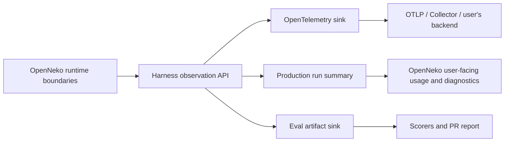

# OpenNeko harness evaluation and telemetry plan

> **IMPLEMENTATION STATUS — 2026-09-10.** The reusable eval core, typed
> observation contract, durable resume journal, deterministic rescoring,
> PR-safe result verifier, CLI (including the `oracles` ground-truth
> extraction command), semantic registry, a 40-case authored AdventureWorks
> corpus (`adventureworks-40q`), direct and delegated GraphJin paths,
> optional OTLP tracing in worker and web execution, persisted production
> summaries, latency/token/cost aggregates, the first executable watcher/action
> lifecycle pack, and backend eval v4 assertion attribution, typed security
> outcomes, independent qualification policy, explicit runtime limits, and dual
> human/technical reports are implemented. See
> [`V4-CONTRACT.md`](./V4-CONTRACT.md). Corpus generation toward
> hundreds of queries and the remaining whole-product suites in section 14
> are still roadmap work; `GROUND-TRUTH.md` defines how ground truth is
> established for the harness-level suites (dashboards, memory/skills work,
> workflow builds, event-driven actions, and composed
> observe→understand→decide→act episodes).

## 0. Try the implemented slice

Community contributors should start with
[`CONTRIBUTING.md`](./CONTRIBUTING.md). It has copy-paste workflows for running
an eval submitted in a pull request, authoring a dataset/case/suite/config, and
checking in only the sanitized result through the normal PR process.

Validation and planning make no provider calls and need no credentials:

```sh
pnpm openneko eval validate --config evals/configs/adventureworks-smoke.yaml
pnpm openneko eval plan --config evals/configs/adventureworks-smoke.yaml
pnpm openneko eval plan --config evals/configs/adventureworks-harness-factorial.yaml

# Complete backend v4 plan: 65 tasks x 3 repetitions, provider-free to inspect.
pnpm openneko eval validate --config evals/configs/openneko-backend-scripted-good-v4.yaml
pnpm openneko eval plan --config evals/configs/openneko-backend-scripted-good-v4.yaml
```

The dedicated v4 control runs through the frozen backend-eval environment and
makes no provider call:

```sh
pnpm eval:backend --smoke-v4 --no-promote
```

Do not use `pnpm dev:setup` for the backend benchmark: that is the product demo
stack and may run date backfilling. The dedicated runner statically rejects the
simulator, scenario injector, and backfill scripts, then verifies the frozen
AdventureWorks fingerprint before and after the run.

The Hermes v4 config is provider-backed. Validation and planning are free, but
a canary or full cohort must not be started until the resolved model, 195
episodes, runtime limits, and budget have explicit operator approval.

With only the seeded oracle database available, `oracles` resolves and prints
every case's ground truth without any provider call:

```sh
pnpm openneko eval oracles --config evals/configs/adventureworks-40q.yaml
```

To run it, start and seed the AdventureWorks demo, provide the credential named
by the selected variant, and invoke `run`. A compatible interrupted run resumes
automatically; `--restart` is the explicit opt-out.

```sh
pnpm dev:setup
export GEMINI_API_KEY=...
pnpm openneko eval run --config evals/configs/adventureworks-smoke.yaml

# Full one-pass, no-repetition comparison across all 20 current episodes:
pnpm openneko eval run --config evals/configs/adventureworks-gemini-model-parity.yaml

# Explicit alternatives:
pnpm openneko eval resume --config evals/configs/adventureworks-smoke.yaml --run <run-id>
pnpm openneko eval run --config evals/configs/adventureworks-smoke.yaml --restart
pnpm openneko eval rescore --config evals/configs/adventureworks-smoke.yaml --run <run-id>

# Product lifecycle coverage needs only the migrated OpenNeko test database;
# it makes no provider/model calls.
pnpm openneko eval run --config evals/configs/openneko-lifecycle-smoke.yaml --no-promote

# Seeded-memory retrieval/isolation, the memory ablation twin, and the skill
# install round-trip — the first phase-keyed oracle-bundle suite; also
# provider-free.
pnpm openneko eval run --config evals/configs/openneko-work-memory-smoke.yaml --no-promote
```

The local journal and raw material stay under ignored `.openneko/evals/` paths.
A completed sanitized result is promoted to `evals/results/` and can be checked
in through a normal pull request after verification:

```sh
pnpm openneko eval verify --result evals/results/<config-id>/<run-id>
pnpm openneko eval report --result evals/results/<config-id>/<run-id>
```

The metric adapter supports Hermes across model providers, direct GraphJin and
the read-only delegated GraphJin server agent, independent outer/inner
provider-model identities, and dataset/config variation. The lifecycle adapter
executes watcher and approval-governed mutation state machines against isolated
test organizations with deterministic clocks, query responses, and action
effects.

AdventureWorks metric episodes start at the same natural-language seam as an
ad-hoc production request: a case supplies only `question` and `role`, the
production classifier derives `slug`/`title`/`why`/`chartHint`, and the metric
agent receives both the exact user question and that derived metadata. Tables,
columns, formulas, anchor details, and expected current/baseline values remain
in the host-only SQL oracle. Episode token, cost, and latency measurements
include classification as well as metric-agent execution.

### Production OpenTelemetry

The worker and Node.js web execution paths export metadata-only traces when an
OTLP endpoint is configured.
Export remains off by default and never carries prompts, queries, tool
arguments/results, model output, database content, or exporter credentials.

```sh
export OTEL_EXPORTER_OTLP_TRACES_ENDPOINT=http://collector:4318/v1/traces
export OTEL_SERVICE_NAME=openneko-worker # use openneko-web for the web service
# Optional standard OTel exporter setting; keep it in the environment only.
export OTEL_EXPORTER_OTLP_HEADERS='authorization=Bearer ...'
```

`OPENNEKO_OTEL_ENABLED=true` enables the SDK when endpoint configuration comes
from another supported OTel mechanism. `OTEL_SDK_DISABLED=true` always wins.
Current production export is traces. Normalized per-run usage, cost, latency,
tool, delegation, retry, and validation summaries are also persisted in the
existing work-run event and processing-job client surfaces, and emitted as
structured logs, so the product path does not depend on a collector.

## 1. Decisions

1. Evaluate the OpenNeko harness as a composition, not only as an LLM call.
2. Support both isolated component comparisons and end-to-end product-path
   evaluations.
3. Treat the dataset as a versioned, reproducible first-class input. Start with
   AdventureWorks, but do not hard-code the runner to it or to PostgreSQL.
4. Let community contributors define configurations, dataset packs, cases,
   scorers, and execution environments in the repository and submit them
   through normal pull requests.
5. Use one canonical in-process observation contract for production and evals.
6. Export that contract to OpenTelemetry for operational observability, persist
   a compact summary for product users, and write a lossless scored artifact
   during eval runs.
7. Do not use OpenTelemetry data as the canonical eval result. Traces may be
   sampled, conventions evolve, and observability backends are optional.
8. Capture no prompts, responses, tool arguments, query text, or tool results in
   production telemetry by default.
9. Keep accuracy, reliability, safety, latency, and cost as separate scorecard
   dimensions. A weighted aggregate must never hide a safety or contract
   failure.
10. Adopt the proven parts of GraphJin's eval architecture: versioned content-
    addressed tasks and suites, pre-resolved runtime oracles, episode/attempt
    journals, compatible auto-resume, deterministic re-scoring, dataset and
    oracle fingerprints, repeated-run voting, failure buckets, and baseline
    comparability gates.
11. Maintain a semantic coverage registry. Every shipped product behavior,
    agent tool, worker job, state machine, and plugin capability must map to an
    eval semantic or an explicitly named non-eval verification suite.

## 2. What is being evaluated

The harness includes more than the outer agent backend. The framework must be
able to vary and attribute at least these factors:

| Factor | Initial values or examples |
|---|---|
| Product path | metric refresh, business profiling, bootstrap metrics, `/work` chat, workflow build/run, actions, source configuration |
| Agent runtime | Hermes |
| Outer provider/model | any valid Hermes provider/model |
| Data path | direct GraphJin query, delegated GraphJin agent, later planner-then-host-execute |
| Inner provider/model | GraphJin agent provider/model, independent from the outer model |
| Dataset | AdventureWorks first; later other databases, files, OpenAPI sources, and multi-source packs |
| Prompt and contracts | prompt version, output schema, role/persona, validation/repair loop |
| Discovery context | knowledge-pack version, catalog mode, discovery pathways, schema freshness |
| Tools and skills | allowed tool catalog, MCP transport, built-in/user skills, tool-output compaction |
| State | fresh or resumed session, conversation length, transcript compaction, memory on/off and memory contents |
| Orchestration | native delegation, maximum steps, retries, timeouts, cancellation, concurrency |
| Security | sandbox/runtime, egress policy, identity/role, GraphJin auth mode, action policy and approval behavior |
| Delivery surface | web/card output, Slack, Telegram, plain text, artifact generation |
| Infrastructure state | cold/warm sandbox and caches, network latency, provider throttling, tool faults, service restarts |

Not every factor should be crossed with every other factor. The runner validates
capabilities and compatibility before execution. For example, a delegated
GraphJin arm requires an enabled GraphJin server agent.

Two comparison tracks are necessary:

- **Provider parity:** hold prompts, tools, data, and budgets constant while
  varying the model provider. This estimates the effect of one factor.
- **Best configured:** allow each provider or data path to use its native
  strengths. This answers which setup a user should actually deploy.

## 3. Evaluation layers

### 3.1 Contract and component evals

Fast, focused tests isolate a seam and give actionable failures:

- provider request/response and usage normalization;
- backend event and structured-output parity;
- prompt construction and validation/repair;
- GraphJin discovery, query, delegation, and auth;
- memory retrieval, isolation, and compaction;
- tool routing, output size/compaction, and error recovery;
- sandbox capabilities and denials;
- action policy, approval, idempotency, and audit behavior;
- channel projection and card/fence validity.

### 3.2 Product-path evals

These execute the same public orchestration boundaries used by production:

- `metric`: answer and render deterministic business metrics;
- `profile`: build a grounded business profile from a source;
- `bootstrap`: propose useful, source-supported executive metrics;
- `work`: answer single- and multi-turn operator requests;
- `workflow`: create and execute a workflow, including trigger and output;
- `action`: propose the right action, apply policy, and execute only when
  permitted;
- `source-admin`: inspect or change source configuration within authorization.

### 3.3 Resilience and adversarial evals

- provider timeout, 429, 5xx, malformed usage, and truncated stream;
- GraphJin timeout, stale catalog, schema change, oversized result, and bad
  query repair;
- sandbox start failure, denied network target, and terminated process;
- prompt injection in source data or tool output;
- secret exfiltration attempts;
- cross-org, cross-user, or role-restricted data requests;
- duplicate action/workflow delivery and interrupted retries;
- long-thread compaction and backend resume divergence.

### 3.4 Load and soak evals

Run separately from quality experiments so concurrency does not confound model
comparisons. Measure queue delay, throughput, resource saturation, provider
limits, sandbox lifecycle, and tail latency.

### 3.5 Semantic coverage registry

[`SEMANTICS.md`](./SEMANTICS.md) is the initial inventory of OpenNeko behavior.
The implementation will encode it as `evals/semantics.yaml` and validate it in
CI. Stable semantic IDs decouple coverage from filenames and allow a case to
prove several behaviors without relying on a tool-call name as the outcome.

Completeness is checked against multiple sources, not maintained by memory:

- every shipped feature in `FEATURES.md`;
- every worker job and public product-path entry point;
- every `AgentEvent`, output fence, and control-plane tool;
- every workflow, watcher, action, and records state transition;
- every plugin capability and channel ingress/egress contract;
- every security boundary, audit event, and sandbox policy outcome.

A new semantic may land as `declared` before it has a live model eval, but it
must name its owning code and planned verification layer. CI fails unknown IDs,
orphaned cases, duplicate ownership, and shipped semantics with no coverage
disposition.

### 3.6 GraphJin reference patterns

GraphJin's current `agent/eval` package is the closest reference implementation.
OpenNeko should adapt these ideas rather than copy its GraphJin-specific task
model:

- public-surface execution instead of importing service internals;
- separate task, suite, episode, attempt, manifest, report, reward, generator,
  and usage-accounting schema versions;
- content IDs and suite fingerprints;
- catalog-derived stratified task generation plus curated regressions;
- resolve all oracles before provider traffic and hash their values;
- score answer, method, behavior, safety, and efficiency separately;
- reset before and after every mutation/reactive episode;
- verify post-state and collateral state;
- majority-of-repeats, consistency, pass-at-k, pass-power-k, bootstrap
  confidence intervals, and category/tier metrics;
- distinguish environment failures from model failures;
- append episodes and attempts atomically, lock runs, and auto-resume only a
  compatible manifest;
- re-score stored episodes without rerunning the model;
- refuse baseline/public comparisons when suite, dataset, oracle, runner, or
  reward identity differs.

## 4. Dataset packs

A dataset pack is a portable fixture plus its independent truth source. It owns:

- a stable `id`, semantic version, license, and content digest;
- source type and engine requirements;
- provisioning, health check, reset, and teardown;
- one or more immutable snapshots or scale tiers;
- GraphJin/source configuration;
- a fixed evaluation clock or data-derived anchor-date policy;
- declared capabilities such as orders, customers, time series, joins, and
  writable actions;
- case bindings and host-only oracle queries;
- expected permissions/roles and allowed mutations;
- seed and anonymization provenance.

For large suites, the pack also owns a deterministic case generator. Generated
cases are sampled with declared category/difficulty quotas and receive stable
content IDs derived from normalized semantics, not list position. Hand-authored
cases remain the regression corpus for reported failures and complex business
questions.

The agent-facing connection and oracle connection must be distinct. Oracle SQL
and expected values are evaluated on the host and are never exposed through the
agent's prompt, workspace, tools, or environment.

Read-only cases may share a provisioned snapshot. Mutating and watcher cases
must use a transactional rollback, copy-on-write clone, or full pack reset
before and after every episode. Every result records the dataset version,
catalog/schema fingerprint, seed-manifest digest, evaluation anchor, and oracle-
value hash—not just the friendly name.

Suggested layout:

```text
evals/
  SEMANTICS.md
  semantics.yaml
  schemas/
  datasets/
    adventureworks/
      dataset.yaml
      provision.ts
      cases/
      oracles/
      graphjin/
  suites/
  configs/
  generators/
  scorers/
  baselines/
  results/
packages/evals/
apps/worker/scripts/openneko-eval.ts
```

AdventureWorks v1 should port the existing 20 metric questions, ground-truth
SQL, exact time-window checks, ranked-dimension checks, preflight, checkpointing,
and redaction from `spike/graphjin-agent-data-path`. It then expands to several
hundred cases through a deterministic catalog-aware generator and curated packs
for joins, business calculations, watchers, and mutations.

Later packs should add different failure shapes rather than merely different
table names:

- small and large schemas;
- sparse, duplicated, null-heavy, and dirty data;
- timezone and fiscal-calendar boundaries;
- slowly changing dimensions and fan-out joins;
- row/role-restricted data;
- schema drift between discovery and execution;
- multiple sources required for one answer;
- safe writable fixtures for action and workflow cases.

Cross-dataset reporting compares capability-tagged cases, not raw question IDs.
For example, `aggregate.date_window`, `join.header_detail`, and
`rank.grouped_top` can exist in several packs with dataset-specific prompts and
oracle implementations.

## 5. Public configuration

Configurations are declarative, reviewable, and safe to commit. Explicit
variants are preferred over an unconstrained Cartesian product. Inheritance
keeps common settings concise while preserving the exact effective config in
the result manifest.

```yaml
schema_version: openneko.eval/v1
id: adventureworks-harness-smoke

pricing:
  ref: ../pricing/standard-2026-07-09.yaml

suite:
  ref: ./evals/suites/metric-readonly.yaml
  cases: [q01, q02, q04, q15, q16]

datasets:
  - ref: ./evals/datasets/adventureworks/dataset.yaml
    snapshot: full

defaults:
  repetitions: 3
  timeout: 10m
  execution_order: counterbalanced
  concurrency: 1
  cache_state: warm
  content_capture: redacted

variants:
  - id: hermes-gemini-direct
    backend: hermes
    outer_model:
      provider: google-gemini
      model: ${OPENNEKO_EVAL_GEMINI_MODEL}
      credential_ref: env:GEMINI_API_KEY
    data_path: graphjin-direct

  - id: hermes-gemini-delegated
    extends: hermes-gemini-direct
    data_path: graphjin-agent
    inner_model:
      provider: google-gemini
      model: ${OPENNEKO_EVAL_GRAPHJIN_MODEL}
      credential_ref: env:GEMINI_API_KEY

  - id: hermes-anthropic-direct
    backend: hermes
    outer_model:
      provider: anthropic
      model: ${OPENNEKO_EVAL_CLAUDE_MODEL}
      credential_ref: env:ANTHROPIC_API_KEY
    data_path: graphjin-direct

budgets:
  max_wall_time: 3h
  max_estimated_cost_usd: 50

artifacts:
  check_in: scored
  raw_dir: .openneko/evals/raw
```

The loader must reject literal credentials and known secret-shaped values.
`credential_ref` is resolved only at runtime and is never copied to the
effective config or result.

Community-facing commands:

```sh
pnpm openneko eval validate --config evals/configs/adventureworks-smoke.yaml
pnpm openneko eval plan --config evals/configs/adventureworks-smoke.yaml
pnpm openneko eval oracles --config evals/configs/adventureworks-smoke.yaml
pnpm openneko eval run --config evals/configs/adventureworks-smoke.yaml
pnpm openneko eval resume --config evals/configs/adventureworks-smoke.yaml --run <run-id>
pnpm openneko eval rescore --config evals/configs/adventureworks-smoke.yaml --run <run-id>
pnpm openneko eval compare --result <result-dir> --baseline <baseline-dir>
pnpm openneko eval verify --result <result-dir>
pnpm openneko eval report --result <result-dir>
```

`plan` expands inheritance, reports incompatible/skipped combinations, estimates
the number of calls and budget, and makes no provider call.

## 6. Scenario and scorer contract

Each case declares:

- stable ID, version, product path, capability tags, and difficulty;
- user input and optional prior turns/files/state;
- dataset requirements and oracle ID;
- timeout and allowed side effects;
- deterministic assertions;
- optional rubric-judge assertions;
- hard gates and diagnostic-only scores.

Scoring priority:

1. **Deterministic correctness:** oracle values, dates, dimensions, rows, files,
   persisted state, and side effects.
2. **Contract validity:** output schema, cards/events, citations/evidence, and
   required fields.
3. **Safety and governance:** access boundaries, policy decision, approval,
   secret handling, and absence of forbidden side effects.
4. **Trace behavior:** correct tool/data path, bounded steps, retries, and
   evidence provenance.
5. **Rubric judge:** relevance, clarity, or usefulness only where deterministic
   scoring cannot express the requirement.
6. **Efficiency:** latency, tokens, estimated/billed cost, tool calls, bytes,
   retries, and infrastructure overhead.

Safety and contract assertions are gates. Rubric judges are versioned like any
other scorer and record their provider, model, prompt digest, and raw score.
They do not override deterministic truth.

### 6.1 Case families and ground truth

The initial large corpus has three execution families:

- **Read/calculation:** resolve a hidden oracle against the same immutable
  snapshot, then compare scalar, date, dimension, ordered rows, time series, or
  structured business calculations. Also score whether the database performed
  aggregation/ranking instead of the model calculating from a truncated page.
- **Watcher/reactive:** reset, install the watch/trigger, establish pre-state,
  inject the source change or advance the clock, wait for a bounded readiness
  predicate, observe deliveries, and verify debounce/dedupe, workflow/action
  effects, audit, and cleanup. Negative controls prove that non-matching changes
  do not fire.
- **Mutation/action:** reset, establish pre-state and policy, let the harness
  propose/approve/execute as the case requires, and verify exact post-state,
  collateral invariants, audit/receipt records, authorization, and idempotency
  under retry. A correct sentence with the wrong or duplicated side effect
  fails.

Oracle kinds are extensible: SQL/GraphQL value, ordered row set, database
snapshot/diff, event sequence, state-machine transition, artifact/file digest,
HTTP/plugin fake receipt, audit-chain predicate, and no-side-effect invariant.
Oracles are evaluated through a trusted host-only connection and may be batched
or cached by `(dataset fingerprint, oracle digest, anchor)`.

All oracles for a planned read-only shard are resolved before model traffic. An
invalid oracle is an environment/corpus failure and spends no provider budget.
For stateful cases, pre-state, readiness, post-state, and collateral oracles are
recorded per episode.

### 6.2 Overall calculations

An episode produces a score vector rather than a single boolean:

- ground-truth correctness;
- method correctness;
- behavior/contract correctness;
- safety/collateral correctness;
- efficiency and resource use.

A task verdict uses majority-of-repeats for gated correctness and reports
consistency separately. The report includes recall, pass-at-k (at least one of
`k` succeeds), pass-power-k (all `k` succeed), confidence intervals, p50/p95
latency, and complete/unknown token and cost accounting.

Model-backed suites should set `min_token_usage_coverage: 1`. The gate checks
that every required model scope reports complete normalized usage; a numeric
total from only one scope cannot satisfy it. Dollar cost is deliberately not a
required gate: a local or self-hosted model may have exact token usage but no
meaningful USD price. Such a run is valid and reports cost as `unavailable`,
never as a silent `$0` estimate.

Overall quality is reported both as micro-average and macro-average across
semantic family, category, difficulty, dataset, and product path. The macro
score is the primary headline so hundreds of easy generated reads cannot drown
out a small number of critical safety, watcher, or mutation cases. Safety,
collateral, authorization, and output-contract gates are always reported as
independent pass/fail ratchets.

Variant comparisons use paired task deltas and compatible cohorts only. A
baseline is incomparable when code/config, suite, dataset, oracle values,
generator, scorer/reward, prompt/tool/skill identity, or execution policy
changes unless the report explicitly opens a new cohort.

## 7. Experimental method

- Run matched cases against every selected variant.
- Randomize or counterbalance variant order per case.
- Use at least three repetitions for smoke comparisons and five or more for a
  product decision when variance is material.
- Record cold/warm state explicitly; do not mix them in one aggregate.
- Keep quality runs serial by default. Test concurrency in a separate suite.
- Separate task failures from infrastructure failures and report both.
- Checkpoint after every case/variant/repetition so interrupted runs resume.
- Report means, medians, percentiles, standard deviation or confidence
  intervals, and paired deltas. Do not publish only totals.
- Pin the dataset, code commit, effective config, prompt/tool/skill digests,
  container images, requested and resolved models, scorer versions, and pricing
  catalog version.
- Record dirty-worktree state. A dirty result is allowed but visibly marked and
  cannot become a protected baseline without maintainer approval.

The standard scorecard contains:

- task accuracy and completion;
- deterministic assertion pass rate;
- output-contract pass rate;
- safety-gate pass rate and violation count;
- grounded/evidenced answer rate;
- wall time, queue time, time to first user-visible output, and p50/p95;
- outer and inner input/output/cache/reasoning tokens with coverage;
- estimated and provider-billed cost, kept distinct;
- inference, tool, delegation, retry, and validation-attempt counts;
- tool input/output sizes and compaction savings;
- variance and failure-mode breakdown by case tag and factor.

### 7.1 Durable resume and sharding

Every executable slot has a stable key:

```text
<suite>/<dataset>/<variant>/<case>/<repetition>/<phase>
```

`phase` distinguishes initial, confirmation, watcher readiness/delivery, and
other multi-episode work. The local state store contains:

```text
.openneko/evals/state/
  runs/<run-id>/manifest.json
  runs/<run-id>/attempts/<slot>-attempt-<n>.json
  runs/<run-id>/episodes/<slot>.json
  runs/<run-id>/oracles.json
  runs/<run-id>/partial-report.json
  locks/<run-id>.lock
```

Writes use temporary files plus atomic rename. Attempts are append-only;
episodes are immutable once complete. The manifest is updated after each
attempt and episode. A process crash therefore loses at most the in-flight
attempt.

`eval run` auto-resumes the newest incomplete compatible run by default.
`--resume <run-id>` selects one exactly; `--restart` deliberately creates a new
run. Compatibility includes effective config, suite, dataset/catalog/seed,
oracle values, binary/source commit, schema versions, generator, scorer/reward,
prompt/tool/skill digests, model settings, and baseline identity. Reused
episodes are revalidated before provider traffic.

An interrupted read slot can retry directly. An interrupted mutation or watcher
slot is never assumed safe: the dataset instance is reset to its fingerprinted
baseline, setup/readiness is replayed, and the entire slot is rerun. Idempotency
and duplicate-effect assertions still inspect durable external fakes or receipts
where the case is specifically testing retry behavior.

Several-hundred-case suites support deterministic shards. Slot ownership is
derived from the stable slot key; each stateful shard receives an isolated
dataset clone. A merge verifies compatible manifests, no duplicate slots, and
expected coverage before producing a report. Changing shard count affects
execution topology, not task identity.

## 8. Checked-in results and pull requests

Open source users can commit configurations, new dataset packs, cases, scorers,
and compact results on a normal branch and submit a pull request.

```text
evals/results/<config-id>/<run-id>/
  manifest.json
  results.jsonl
  summary.json
  summary.md
```

Checked-in artifacts contain scores, normalized measurements, redacted errors,
and provenance. They exclude secrets, full prompts/responses, tool arguments and
results, raw SQL/GraphQL, customer identifiers, and full OTel payloads. Raw
transcripts and traces live under `.openneko/evals/raw/`, are gitignored by
default, and may be uploaded to separately controlled storage.

The resumable local state store is also ignored. A completed run is promoted to
the compact checked-in layout only after `eval verify` confirms completeness,
fingerprints, scoring provenance, usage coverage, and redaction. `rescore`
creates a new report from stored episodes without mutating the source run.

Every manifest contains:

- artifact schema version and runner version;
- source commit, dirty flag, config digest, and effective config;
- dataset, prompt, skill, tool-catalog, scorer, and image digests;
- requested and resolved provider/model identifiers;
- environment and execution policy;
- selected, completed, skipped, and failed run keys;
- telemetry coverage and missing-field reasons;
- parent/baseline result reference;
- digest of every checked-in result file.

Results are append-only evidence. Updating a config or rerunning it creates a
new result directory instead of editing an old result.

Checked-in evidence may be accepted or rejected. A rejected result remains
explicitly marked `accepted: false`, stays visible for comparison and
regression work, and is not a passing backend or release qualification. The
repository check verifies artifact integrity, recomputes the aggregate and
suite gates, and confirms that the stored accepted/rejected classification
matches those gates; it does not suppress valid failure evidence.

PR CI should:

1. validate config, dataset, case, result, and scorer schemas;
2. reject embedded credentials, unsafe content, and disallowed artifact size;
3. verify digests, run-key completeness, and scorer provenance;
4. recompute deterministic aggregates from `results.jsonl`;
5. compare with the selected baseline and generate a Markdown delta report;
6. apply regression thresholds defined by the suite;
7. label results `self-reported` or `ci-attested`.

External fork workflows must not receive repository secrets. Provider-backed CI
runs require an explicit maintainer-controlled workflow/approval; untrusted PR
code and dataset provisioners must not execute with model or infrastructure
credentials. A PR may still contribute a locally produced, self-reported result
for review.

## 9. One observation contract, three sinks



The observation API is a typed, versioned, provider-neutral internal stream;
it is not the rendering-oriented `AgentEvent` stream. A compact content-free
summary derived from it is deliberately persisted as an `AgentEvent` envelope
for work-run API clients, while raw observations and spans never enter channel
rendering.

Initial observation kinds:

- `run.start`, `run.first_output`, `run.end`;
- `stage.start`, `stage.end`;
- `model.request`, `model.first_chunk`, `model.response`;
- `tool.start`, `tool.end`;
- `delegation.start`, `delegation.end`;
- `memory.start`, `memory.end`;
- `policy.decision`, `approval.decision`;
- `validation.result`, `retry`;
- `output.contract`, `error`.

Every observation carries a timestamp, trace/span relationship, harness run ID,
operation ID, status, low-level measurements, and a sanitized attribute map.
Consumers must never have to parse console text or backend-specific raw usage.

### Why the three sinks differ

- **OpenTelemetry** provides distributed traces, operational metrics,
  correlation, sampling, and vendor-neutral export.
- **Production summary storage** provides reliable user-visible history even
  when OTel is disabled, sampled, or exported to infrastructure the OpenNeko UI
  cannot query.
- **Eval artifacts** preserve every selected run and scorer input needed for a
  reproducible comparison, independent of an observability vendor.

## 10. OpenTelemetry mapping

Use stable core OpenTelemetry conventions and the dedicated GenAI semantic
conventions where applicable. The GenAI agent, tool, and metric conventions are
currently development-status, so pin the schema URL/version and isolate mapping
code behind the observation sink.

Recommended span tree:

```text
openneko.eval.case                         # eval-only root
└── invoke_agent openneko.<product-path>  # production root or eval child
    ├── openneko.prepare_workspace
    ├── search_memory
    ├── openneko.load_knowledge
    ├── chat|generate_content <model>     # each observable inference call
    ├── execute_tool <tool-name>
    │   ├── GraphQL/HTTP/DB client span
    │   └── invoke_agent graphjin         # when GraphJin delegates internally
    ├── openneko.validate_output
    └── openneko.persist_output
```

For a workflow, use `invoke_workflow` as the outer production operation and
link or nest the participating agent/action spans. Use W3C Trace Context across
HTTP and messaging; pass trace context explicitly into the sandbox, Hermes/ACP
subprocess, MCP bridge, broker, and GraphJin client boundary.

Standard attributes include:

- `service.name`, `service.version`, and deployment resource attributes;
- `gen_ai.operation.name`;
- `gen_ai.agent.name`, `gen_ai.agent.version`, and
  `gen_ai.conversation.id` when a real conversation ID exists;
- `gen_ai.provider.name`, `gen_ai.request.model`, and
  `gen_ai.response.model`;
- `gen_ai.data_source.id`;
- `gen_ai.tool.name`, type, and call ID;
- `gen_ai.usage.input_tokens`, `gen_ai.usage.output_tokens`, cache creation/read
  tokens, and reasoning output tokens;
- `error.type`, server address, and provider response identifiers where safe.

OpenNeko-specific attributes use the `openneko.*` namespace:

- `openneko.run.id`, `openneko.run.kind`, `openneko.backend`,
  `openneko.channel`, and `openneko.outcome`;
- `openneko.data.path` and `openneko.data.auth_mode`;
- `openneko.prompt.id/version/digest`, `openneko.skillset.digest`,
  `openneko.toolset.digest`, and `openneko.knowledge.digest`;
- `openneko.sandbox.runtime`, `openneko.cache_state`, retry count, validation
  attempts, and policy outcome;
- eval-only suite, case, variant, repetition, dataset, and config identifiers.

High-cardinality IDs and digests belong on spans/artifacts, not metric labels.
Organization, user, thread, run, query, tool-call, and result IDs must not become
metric dimensions.

Use the GenAI metric names where they fit:

- `gen_ai.client.token.usage`;
- `gen_ai.client.operation.duration` and time to first chunk;
- `gen_ai.invoke_agent.duration`, inference calls, and tool calls;
- `gen_ai.invoke_workflow.duration`;
- `gen_ai.execute_tool.duration`.

OpenNeko metrics fill product-specific gaps:

- run count/duration and time to first user-visible output by product path,
  backend, channel, and outcome;
- queue and sandbox startup duration;
- validation failures/attempts and retries;
- GraphJin query/delegation duration, errors, response bytes, and row counts;
- tool input/output bytes and estimated compaction savings;
- memory search duration and hit count;
- policy denials, approval decisions, action outcomes, and approval latency;
- telemetry dropped/export-failure counters.

Cost should be derived from normalized usage plus a versioned pricing catalog.
Store estimated and provider-billed cost separately and retain the catalog
version. Never silently present an estimate as a bill or missing pricing as
zero cost. Provider-billed cost wins when supplied; otherwise a catalog-backed
estimate is optional. Local/self-hosted models can report exact tokens with
cost coverage marked unavailable.

## 11. Production-facing run summary

`work_run` records backend, status, timestamps, and error, while non-chat agent
work is represented by `processing_job`. The implemented v1 stores the compact
summary as a `telemetry` work-run event and under `processing_job.result.telemetry`.
This makes it available through existing client APIs without a migration. A
future common `harness_run` table can unify retention and fleet queries across
`work_run`, `processing_job`, and `workflow_run`.

Minimum fields:

- run/trace/parent IDs, org ID, product path, and trigger/channel;
- backend, outer provider, requested/resolved model, and data path;
- inner provider/model when delegation occurs;
- start, first output, finish, queue, and sandbox timings;
- status and normalized error type;
- input/output/cache/reasoning token totals and coverage;
- inference, tool, delegation, retry, and validation counts;
- estimated/billed cost, currency, and pricing version;
- data sources touched as stable IDs, not captured query text;
- safety/policy summary and action counts;
- prompt, toolset, skillset, and knowledge digests;
- OTel trace ID and telemetry completeness.

The product can use this summary for per-run diagnostics, usage/cost views,
support bundles, and fleet-level reliability without requiring a particular
observability backend. Detailed spans remain in the user's chosen OTel system.

## 12. Privacy, security, and cardinality

Telemetry modes:

- `off`: no OTel SDK/export; required product run summary still records safe
  operational totals;
- `metadata` (recommended): traces and metrics without prompt/response/tool/query
  content;
- `redacted`: opt-in content capture after the same secret scrubber used by the
  agent surface, with length limits;
- `full`: explicit local/development opt-in with strong warnings and separate
  retention controls.

For production, prefer storing sensitive captured content outside span
attributes and recording an access-controlled reference. Export through an
OpenTelemetry Collector so deployments can batch, retry, encrypt, filter,
redact, and route telemetry without application changes.

Additional requirements:

- no vendor endpoint or remote telemetry export by default;
- OTLP endpoint, headers, TLS, sampling, and resource attributes are
  operator-controlled;
- secrets are scrubbed before all sinks, not only in the Collector;
- raw exception messages are sanitized; use low-cardinality `error.type`;
- tenant/user IDs are omitted or hashed in exported telemetry by default;
- always retain errors, timeouts, policy denials, and anomalously slow traces
  when tail sampling is available;
- eval mode is unsampled for selected runs;
- instrumentation failure never changes the agent outcome;
- content retention and deletion are independent from operational metrics.

## 13. Remaining telemetry gaps

The shared contract, backend usage normalization, delegated GraphJin usage,
metric and `/work` instrumentation, persisted client summaries, aggregate eval
measurements, and optional Node OTLP trace export are implemented. Remaining
work is deliberately visible:

- instrument onboarding, workflow, channel, records, and admin paths to the
  same depth as metric refresh and `/work`;
- propagate W3C trace context through queues, sandbox/broker, MCP, and GraphJin
  HTTP rather than correlating only within the worker process;
- add a common cross-product summary table and dedicated UI views beyond the
  existing work-event and processing-job API representations;
- add OTel metric instruments and collector dashboards after stable cardinality
  budgets are defined; traces are the only exported signal today;
- expand the initial standard API pricing catalog to more providers, service
  tiers, regions, and cache-storage time pricing;
- add tail-sampling/export-health integration and retention controls.

## 14. Implementation sequence

### Milestone 1 — contracts and local instrumentation

- add `packages/telemetry` with typed observations, a no-op default, redaction,
  summary accumulator, and tests;
- define the checked-in eval config/result JSON schemas and custom attribute
  registry;
- instrument the shared product-path boundaries and existing tool events;
- normalize usage from Hermes and GraphJin with explicit coverage
  and missing-reason fields;
- expand the existing persisted summaries into a common `harness_run` index and
  trace-ID links;
- verify that instrumentation cannot change runtime behavior.

### Milestone 2 — OpenTelemetry export

- add optional Node SDK initialization for worker and web processes;
- export traces and metrics via OTLP, preferably to a Collector;
- map observations to pinned GenAI conventions and `openneko.*` attributes;
- propagate trace context across queues, subprocesses, sandbox/broker, MCP, and
  GraphJin HTTP;
- add metadata/redacted/full content controls, sampling, and export health;
- provide a local example stack and dashboard queries without requiring it.

### Milestone 3 — reusable eval core

- add `packages/evals` config loader, planner, capability validator, runner,
  checkpoint store, scorer registry, comparison engine, and report generator;
- implement the CLI commands in `apps/worker/scripts/openneko-eval.ts`;
- add dataset-pack lifecycle and safe secret references;
- emit lossless eval artifacts from the same observation stream;
- add atomic attempt/episode journals, run locking, compatible auto-resume,
  deterministic re-scoring, sharding/merge, and failure classification;
- add schema, digest, resume, crash recovery, mutation reset, budget, and
  redaction tests.

### Milestone 4 — AdventureWorks baseline

- port the 20 existing questions and SQL oracles;
- add catalog-aware generation with category/difficulty quotas and stable IDs,
  growing the read/calculation corpus toward several hundred cases;
- add resettable watcher/reactive and mutation/action packs with pre-state,
  readiness, post-state, collateral, audit, and idempotency oracles;
- cover Hermes across selected providers, direct/delegated GraphJin, and
  provider/model variants with compatibility validation;
- run repeated, counterbalanced baselines;
- check in compact scored results through a PR;
- archive the old bespoke experiment after parity is demonstrated.

### Milestone 5 — whole-harness coverage

- add `/work`, profile/bootstrap, memory, action, workflow, channel, governance,
  resilience, and load suites;
- add a second structurally different dataset pack;
- add PR comparison reporting and protected regression thresholds;
- expose production run/cost/reliability summaries to users.

## 15. Acceptance criteria for the first release

- A fresh contributor can validate and inspect an eval plan without credentials.
- A contributor with valid local credentials can run the AdventureWorks smoke
  config, interrupt it, resume it, and produce the same set of run keys.
- A hard process kill during a run reuses every verified completed slot and
  safely reconstructs the in-flight mutation/watcher fixture instead of
  restarting or trusting ambiguous state.
- The same case runs through Hermes with at least two providers, and through
  direct and delegated GraphJin data paths.
- Adding another dataset requires a dataset pack, not runner edits.
- Every result identifies exact code/config/dataset/scorer/model provenance and
  telemetry coverage.
- Checked-in artifacts are compact, deterministic in shape, secret-scanned, and
  reviewable in a normal PR.
- CI can verify and compare a result without access to raw prompts or an OTel
  backend.
- Production can export metadata-only traces to an arbitrary OTLP endpoint or
  run with export disabled; metric instruments remain a stated follow-up.
- Users can inspect reliable per-run usage, cost, latency, and failure summaries
  even when OTel export is disabled or sampled.
- Eval and production measurements agree because both consume the same typed
  observation stream.
- Overall reports contain ground-truth, method, behavior, safety, efficiency,
  repeat-consistency, macro/micro, category/difficulty, and paired baseline
  calculations; no count of simple read cases can mask a watcher/mutation or
  safety regression.

## References

- GraphJin eval package and public benchmark architecture:
  <https://github.com/dosco/graphjin/tree/master/agent/eval>
- OpenTelemetry GenAI semantic conventions:
  <https://github.com/open-telemetry/semantic-conventions-genai>
- OpenTelemetry JavaScript:
  <https://opentelemetry.io/docs/languages/js/>
- OpenTelemetry Collector:
  <https://opentelemetry.io/docs/collector/>
- OpenTelemetry security guidance:
  <https://opentelemetry.io/docs/security/>
